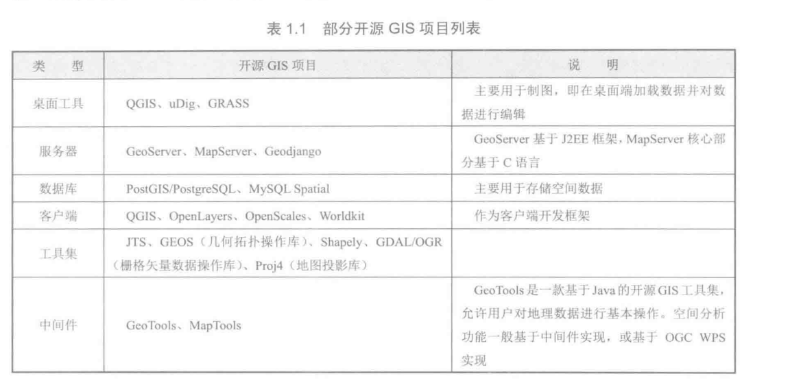
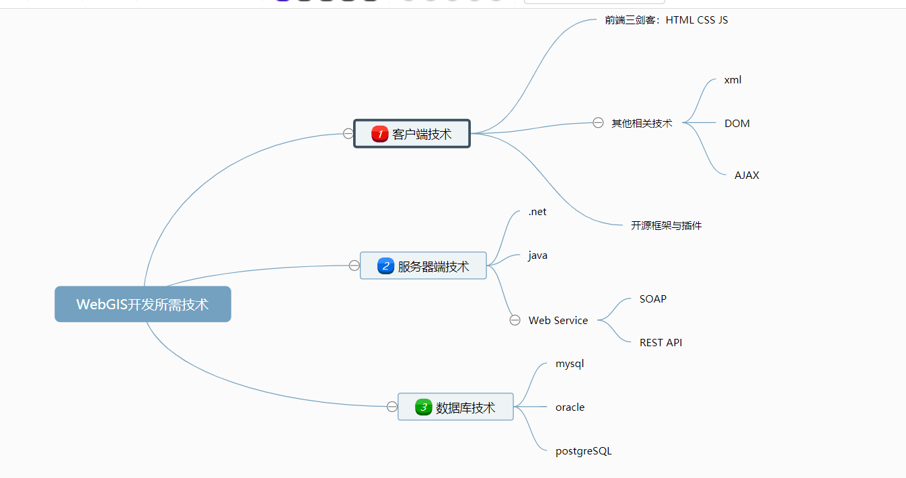
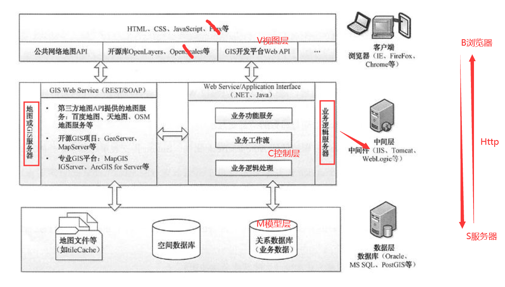
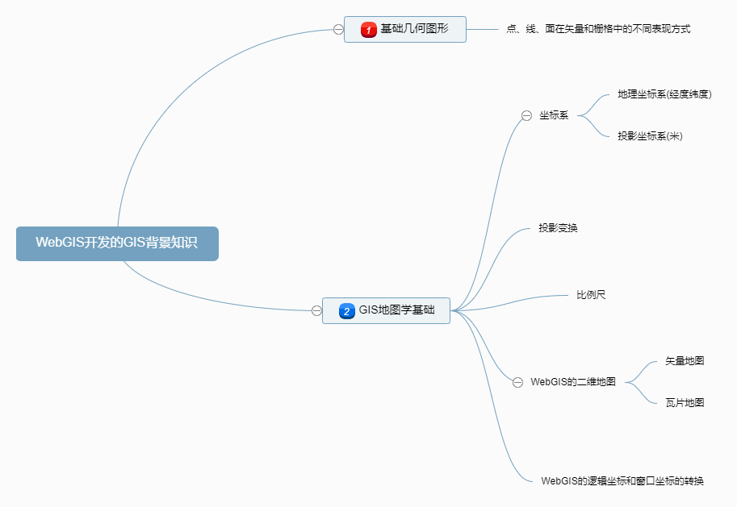

# **WebGIS开发基础**

## 1.GIS定义

地理信息系统GIS(Geographic Information System)是一种特定的十分重要的空间信息系统，它是在计算机软硬件的支持下，以采集、存储、管理、检索、分析和描述空间物体的**空间数据**及与之相关的**属性数据**，并回答用户问题等为主要任务的计算机系统。

## 2.WebGIS定义

WebGIS(网络地理信息系统)，即Web+GIS,侠义来说就是基于B/S架构(Browser/Server，浏览器/服务器架构)通过Web浏览器访问的GIS。相对于C/S(Client/Server,客户机/服务器)架构，B/S架构具有部署方便、使用简单、便于推广等优势。

例如：

​	后端结合Springboot使用的WebGIS项目，最终我们只需要打成一个可执行的jar包即可运行。

常见WebGIS开源平台：

**基于JavaEE的解决方案**：GeoServer(服务器)+uDig(桌面软件)+Tomcat(中间件web服务器)+PostGIS|MySQL空间扩展(数据库)+Openlayers(前端JS)

采用WebGIS平台进行二次开发，一般是从客户端、服务器端、数据源与数据存储方面进行设计和实现的，关于一些非开源技术，例如：Arcgis、Arcgis server、Arcgis Engine、Oracle Spatical等，可以根据自己实际情况选择使用。

(1)Web客户端：可以选择使用Arcgis js api或者Openlayers开源框架，也可以结合互联网方向的在线地图API(如百度地图API、本项目使用的天地图API等 )

(2)服务器端：最具代表的为GeoServer或MapServer作为地理信息服务器(中间件Web服务器选Tomcat,IIS等),基于服务器发布的地图数据服务(如OGC的WMS、WFS、WCS等)，web应用程序通过Http请求访问服务器发布的数据服务，若设计简单的大众应用WebGIS,可以不使用服务器开源GIS平台，直接访问第三方提供的数据服务，数据接口，或者存储在关系数据库的POI数据(POI是“Point of Information”的缩写，中文可以翻译为“信息点”。在地理信息系统中，一个POI可以是一栋房子、一个商铺、一个邮筒、一个公交站等)

(3)数据层：数据源可以使用公共的在线地图服务(如百度地图、天地图、Google地图等)，一般将它们作为地图，或者使用GIS服务器发布自己的地图服务数据，以及开放格式的文件数据。针对空间是数据的存储，一般可选择开源的空间数据库，如使用PostgreSQL作为关系型数据库，用其扩展模块PostGIS存储空间数据。

## 3.WebGIS开发所需的技术

## 4.WebGIS的框架结构

## 5.WebGIS开发的GIS背景知识

★矢量地图和瓦片地图各具特点和优势，可以结合使用。矢量地图是实时生成的，可以对地图数据进行在线编辑、查询分析，具有空间关系属性，能支持网络分析、空间分析等应用。瓦片地图是预裁剪的缓存图片集，具有网络加载速度较快、效果较好的特点，常作为底图使用。

★逻辑坐标是指实际的地理坐标，即数据坐标系，表示真实的地理空间位置；窗口坐标是指在Web网页中逻辑坐标对应的屏幕坐标，是根据Web网页中地图容器布局，对逻辑坐标进行转换而得到的

在web地图中进行拉框查询时，会用到逻辑坐标与窗口坐标的转换

