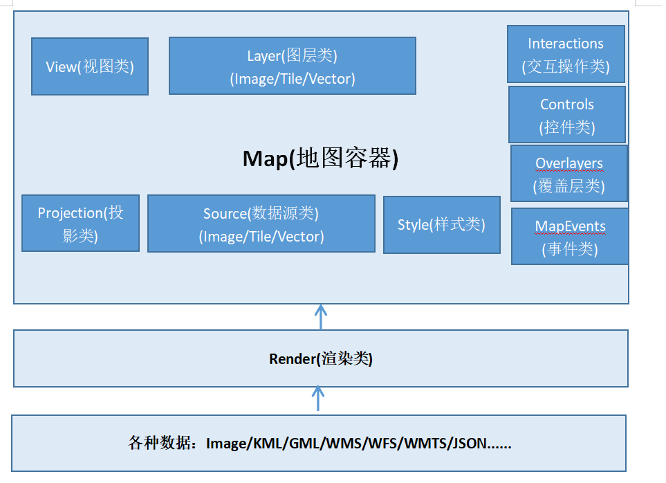
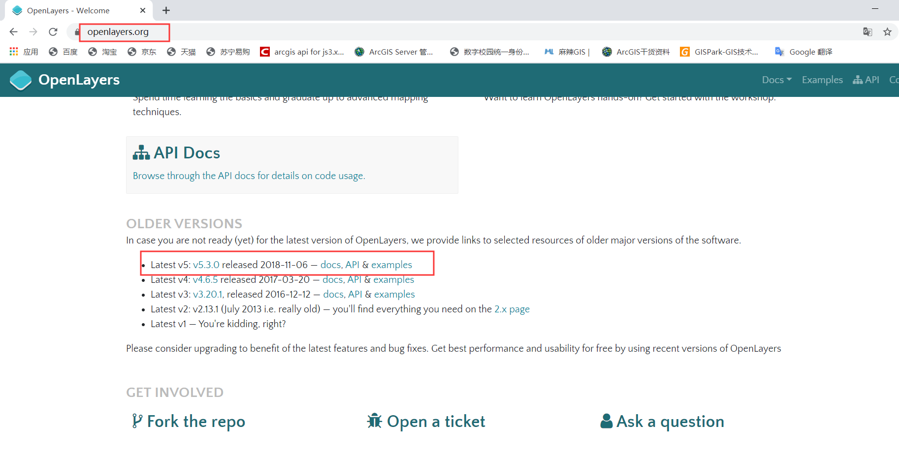
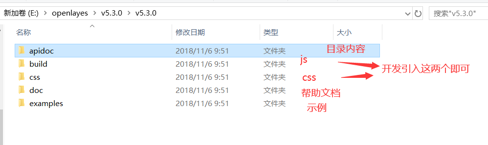

# Openlayers概述

## 1.Openlayers是什么

Openlayers是一个模块化、高性能并且功能丰富的**WebGIS客户端的JavaSript包**，用于显示地图及空间数据，并与之进行交互，具有灵活的扩展机制。

## 2.Openlayers5的体系架构

Openlayers将抽象事物具体化为类，其核心类是Map、Layer、Source、View，几乎所有的动作都围绕这个核心类展开，从而实现地图的加载和相关操作。

上图为Openlayers5的体系架构图，可以将整个地图看成一个Map容器，核心为地图图层Layer，对应图层的数据源Source与矢量图层样式Style，与地图表现相关的地图视图View，还有一些覆盖层Overlayers，地图交互的操作控件Interactions，以及绑定在Map和Layer上的一系列请求事件，底层是Openlayers的数据源，这些数据源经过Render渲染，显示在地图容器中的图层Layer上。

## 3.Openlayers5核心类的简介

### (1)类

★**Map**(ol.Map)：地图容器，核心部分，可加载各类地图与功能控件，用于渲染、表现动态地图

★**WebGLMap**(ol.WebGLMap)：使用WebGL渲染的地图容器，使用WebGL渲染地图图层，但是该容器对矢量数据的支持有限，目前不支持矢量瓦片数据。

★**View**(ol.View)：地图视图，控制地图缩放等的基本交互，以及地图投影坐标系、地图中心点、分辨率、旋转角度等。

★**Layers**(ol.Layer.Base)：图层，包含多个调用数据的子类，由子类的实例加载地图数据，必须结合图层数据源匹配使用

★**Source**(ol.source.Source)：图层数据源，与图层子类对应，由图层数据源的实例来加载各种类型的地图数据

★**Format**(ol.format.Format)：数据解析类，此类用于读写各种格式的数据，并创建了多种格式的子类，即数据解析器。目前支持多种数据格式，如：GeoJson、GML、XML、WKT、WFS等。

★**Geometry**(ol.geom.Geometry)：地理空间对象的几何实体，由其子类(如Point、LineString、Polygon)的实例构成所看到的矢量地图

★**Feature**(ol.Feature)：地图要素，可以看出矢量地图的组成单元，是地图中的主要部分。例如：点、线、面等几何实体均位地图要素，可配合要素的样式渲染到客户端的地图上。

★**Overlay**(ol.Overlay)：叠加层，即叠加到地图上显示的要素，关联了一个自定义的HTML要素，由一个单一的地图坐标点确定叠加的位置。与控件类似，但不同的是叠加元素不是固定在一个固定的屏幕位置上， 而是通过关联一个地图的逻辑坐标点跟随地图移动，如：标注点，popup等。

★**Controls**(ol.control.Control)：即通常所说的控件类，可提供各种各样的地图功能控件，如地图缩放控件(Zoom)，鼠标位置控件(MousePosition)，鹰眼(OverViewMap)，比例尺(ScaleLine)控件等。

★**Interaction**(ol.interaction.Interaction)：地图交互控件类。地图交互一般通过鼠标和键盘进行，因此Interaction的子类为基于鼠标与键盘操控的地图交互功能控件，如：选择要素控件(Select)，键盘缩放地图控件(KeyboradZoom)，鼠标控件基类(Pointer)下的绘制控件(Draw)，修改控件(Modify)，拖放平移地图控件(DrawPan)

★**Style**(ol.style.Style)：样式类，可通过其子类实例来渲染矢量要素的样式，包括填充样式(Fill)、边界样式(Stroke)、图标样式(Image与Icon)，文字样式(Text)等

★**Projections**(ol.pro.Projection)：地图投影定义类，包括EPSG:4326(ol.proj.EPSG4326)与EPSG:3857(ol.proj.EPSG:3857)的定义，用于在地图视图View中设置地图的投影坐标系，也可通过ol.proj提供的方法进行投影变换。

★**Render**(ol.render.Render)：渲染器，在Openlayers5中，渲染功能是作为Map类的一个属性存在的，支持Canvas与WebGL两种渲染方式，可通过设置Map类的render属性设置渲染方式。

### (2)类的事件

★ol.**MapEvent**：地图事件类，继承于ol.events.Event，其子类ol.MapBrowserEvent，可查看ol.Map中哪些事件触发了地图事件，如单击(click)、双击(dbclick)、鼠标拖拽(pointerdrag)，鼠标移动(pointermove)，单次单击(singleclick)等事件可以触发地图浏览器事件(ol.MapBrowserEvent)，而移动结束(moveend)事件可触发地图事件★ol.Object.Event：ol.Object的事件，继承于ol.events.Event，可以提供属性变更事件(Propertychange)，当属性发生变更时触发此事件

其他事件

地图交互绘制事件(ol.interaction.Draw.Event)，交互选择事件(ol.interaction.Select.Event)、集合事件(ol.Collection.Event)、地图渲染事件(ol.render.Event)

## 4.openlayers下载和使用

官网下载：

目录结构：

