# Openlayers快速入门

## 1.环境搭建

(1)初始化springboot项目

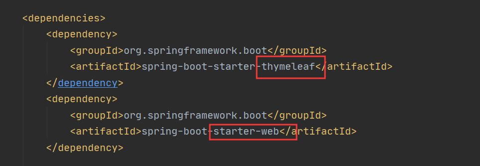

导入web启动器和thymeleaf模板

(2)项目结构

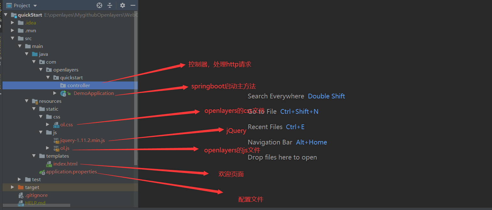

## 2.地图显示

使用Openlayers加载天地图

```html
<!DOCTYPE html>
<html lang="en">
<head>
    <meta charset="UTF-8">
    <meta name="viewport" content="width=device-width, initial-scale=1.0">
    <meta http-equiv="X-UA-Compatible" content="ie=edge">
    <title>使用openlayers调用天地图</title>
    <!--引入openlayers的css文件和js文件-->
    <link rel="stylesheet" href="css/ol.css" />
    <script src="js/ol.js"></script>
    <style type="text/css">
        #mapCon {
            width: 100%;
            height: 95%;
            position: absolute;
        }
    </style>
</head>
<body>
<div id="mapCon">
</div>
<script type="text/javascript">
    "use strict";
    //实例化map对象加载地图
    var map = new ol.Map({
        //地图容器div的id
        target: 'mapCon',
        //地图容器中加载的图层
        layers: [
            //加载瓦片图层数据
            new ol.layer.Tile({
                title: "天地图矢量图层",
                source: new ol.source.XYZ({
                    url: "http://t0.tianditu.com/DataServer?T=vec_w&x={x}&y={y}&l={z}&tk=b74ca9a5dbd96fab6338ab9d239180fb",
                    wrapX: false
                })
            }),
            new ol.layer.Tile({
                title: "天地图矢量图层注记",
                source: new ol.source.XYZ({
                    url: "http://t0.tianditu.com/DataServer?T=cva_w&x={x}&y={y}&l={z}&tk=b74ca9a5dbd96fab6338ab9d239180fb",
                    wrapX: false
                })
            })
        ],
        //地图视图设置
        view: new ol.View({
            //地图初始中心点
            center: [0, 0],
            //地图初始显示级别
            zoom: 3,
            //参考系设置
            projection: "EPSG:4326"
        })
    });
</script>
</body>
</html>
```

实现思路：创建一个地图容器对象ol.Map，通过target参数关联到地图容器(ID为mapCon的div层)，通过layers参数设置加载瓦片图层(ol.layer.Tile)，绑定数据源(ol.source.XYZ)，然后通过ol.View设置地图视图

也可以通过以下方法动态添加和移除图层：

- 添加指定图层：`map.addLayer(layer)`；
- 移除指定图层：`map.removeLayer(layer)`；

写一个简单controller和<a>链接跳转即可

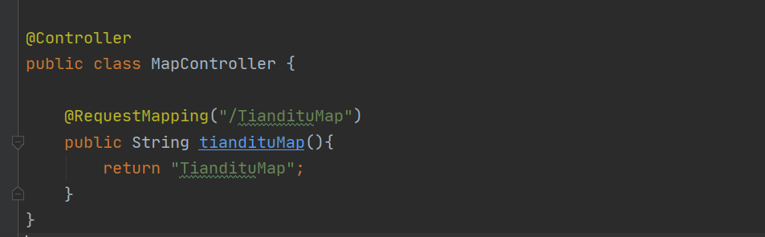

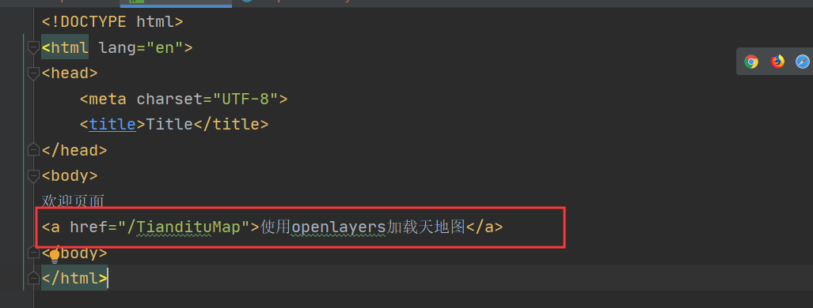

效果：

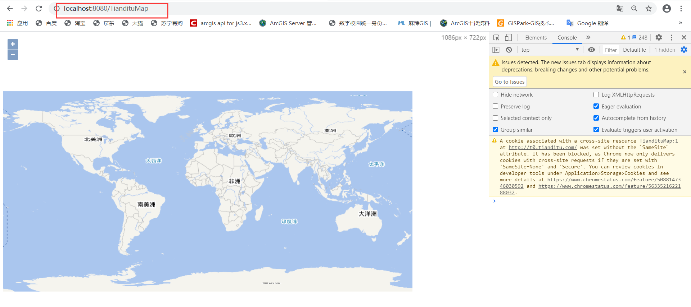

## 3.导航控件

**控件总述**：每一个地图应用系统中都应该有一些工具来方便用户控制地图的操作，如：缩放、全屏显示、坐标显示等工具，这些工具就是地图控件。openlayers5封装了很多常用的地图控件，如地图导航、鹰眼、比例尺、鼠标位置等，这些控件是基于ol.controls.Control基类进行封装的，即ol.control.Control的子类为各类常用的地图功能控件，可以通过map对象的controls参数设置，或者调用map的addControl方法添加到地图窗口中。

地图控件是基于HTML元素实现的，每个控件都可以作为一个DOM元素显示在屏幕中的某个位置，可以通过css自定义控件的样式。

openlayers5的地图容器通过ol.control.defaults默认加载3个常用的控件，缩放控件(ol.control.Zoom)、旋转控件(ol.control.Rotate)、图层数据源属性控件(ol.control.Attribution)

**导航控件**：Openlayers5提供的地图导航控件包括：地图缩放控件(ol.control.Zoom)，缩放滑块(ol.control.ZoomSlider)，按钮式缩放到特定范围的控件(ol.control.ZoomToExtent)，最常用的就i是缩放控件和缩放滑块结合使用

核心代码：

```javascript
//实例化ZoomSlider控件(缩放滑块控件)并加载到地图容器中
    var zoomslider = new ol.control.ZoomSlider();
    map.addControl(zoomslider);
    //实例化zoomToExtent控件并加载到地图容器中（按钮式缩放到指定范围控件）
    var zoomToExtent = new ol.control.ZoomToExtent({
        extent: [
            93.7598, 52.1387,
            129.9707, 68.3691
        ]
    });
    map.addControl(zoomToExtent);   //通过map.addControl(control);方法动态添加控件
```

效果：

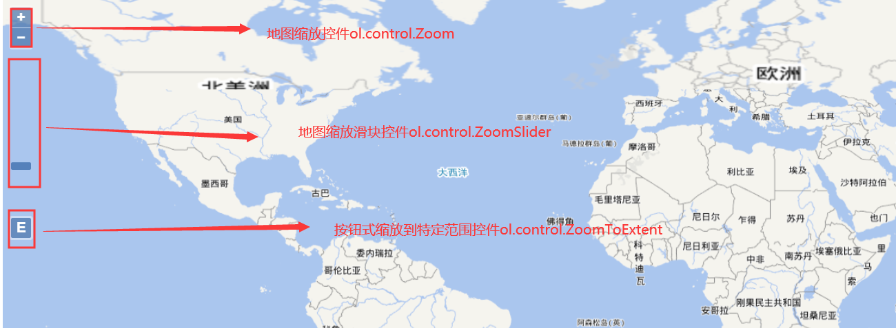

## 4.地图基本操作控件

地图基本操作是指用户与地图的简单交互，主要包括地图放大、缩小、移动、复位和更新等，其**核心方法就是操作地图视图View类，通过View中各个属性的get()，set()方法即可实现。**

思路：在地图容器的div层中分别添加4个按钮(button)，设置按钮的ID值，然后为这些按钮添加相应的单击函数，在函数中调用openlayers中地图视图View类的相应方法，分别实现单击放大、单击缩小、移动到某一位置及复位功能。

核心代码：

```html
<div class="ToolLib">
    <input type="button" class="ButtonLib" id="zoom-out" value="单击缩小" />
    <input type="button" class="ButtonLib" id="zoom-in" value="单击放大" />
    <input type="button" class="ButtonLib" id="panto" value="平移到【中国】" />
    <input type="button" class="ButtonLib" id="restore" value="复位" />
</div>
```

```javascript
//地图视图设置    初始地图中View的各个属性
        view: new ol.View({
            //地图初始中心点
            center: [0, 0],
            //地图初始显示级别
            zoom: 3,
            mixZoom:1, //缩放的最小级别
            maxZoom:12, //缩放的最大级别
            rotation:Math.PI/6,  //顺时针旋转30度
            //参考系设置
            //projection: "EPSG:4326"
        })
```

```javascript
//单击缩小按钮功能
 //地图视图的初始参数
    var view = map.getView();
    var zoom = view.getZoom();
    var center = view.getCenter();
    var rotation = view.getRotation();
    document.getElementById('zoom-out').onclick = function () {
        //获取地图视图
        var view = map.getView();
        //获得当前缩放级数
        var zoom = view.getZoom();
        //地图缩小一级
        view.setZoom(zoom - 1);
    };
```

```javascript
//单击放大按钮功能
    document.getElementById('zoom-in').onclick = function () {
        //获取地图视图
        var view = map.getView();
        //获得当前缩放级数
        var zoom = view.getZoom();
        view.setZoom(zoom + 1);
        //地图放大一级
    };
```

```javascript
//平移功能（移到到武汉市）
    document.getElementById('panto').onclick = function () {
        //获取地图视图
        var view = map.getView();
        var wh = ol.proj.fromLonLat([105.0098,35.6543]);
        //平移地图
        view.setCenter(wh);
        view.setZoom(5);
    };
```

```javascript
//复位功能（复位到初始状态）
    document.getElementById('restore').onclick = function () {
        //初始中心点
        view.setCenter(center);
        //初始旋转角度
        view.setRotation(rotation);
        //初始缩放级数
        view.setZoom(zoom);
    };
```

效果：

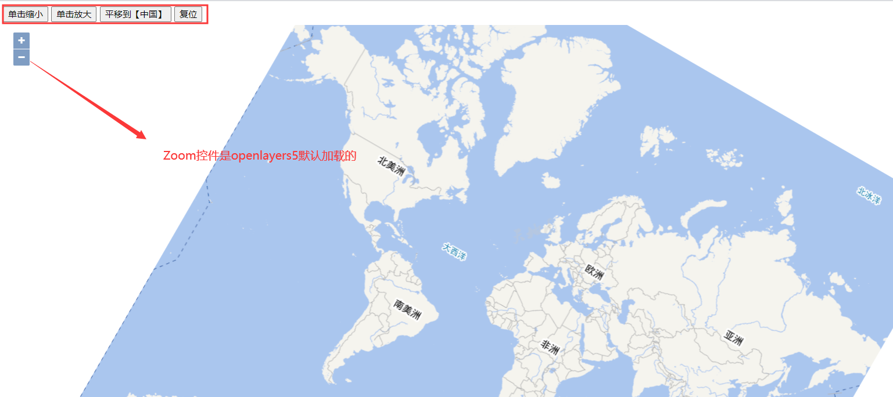

## 5.鼠标位置控件

鼠标位置控件(ol.control.MousePosition)时用来显示当前地图容器中鼠标焦点的空间坐标点的坐标值。

思路：在地图容器对应的div层中新建一个显示鼠标位置的div层，即ID为mouse-position的div层，并将z-index显示在地图上

核心代码：

```html
<div id="mapCon">
    <div id="mouse-position"><!--鼠标位置控件的容器，即所处的位置-->
    </div>
</div>
```

```javascript
//实例化鼠标位置控件（MousePosition）
    var mousePositionControl = new ol.control.MousePosition({
        //坐标格式,将坐标保留4位小数位，并转换位字符串形式
        coordinateFormat: ol.coordinate.createStringXY(4),
        //地图投影坐标系（若未设置则输出为默认投影坐标系下的坐标）
        projection: 'EPSG:4326',
        //坐标信息显示样式类名，默认是'ol-mouse-position'
        className: 'custom-mouse-position',
        //显示鼠标位置信息的目标容器
        target: document.getElementById('mouse-position'),
        //未定义坐标的标记   显示空格
        undefinedHTML: '&nbsp;'
    });
```

将鼠标位置控件通过map的controls属性添加到地图容器

```javascript
//加载控件到地图容器中
        controls: ol.control.defaults({//地图中默认控件
            /* @type {ol.control.Attribution} */
            attributionOptions: ({
                //地图数据源信息控件是否可收缩,默认为true
                collapsible: true
            })
        }).extend([mousePositionControl])//加载鼠标位置控件
```

效果：

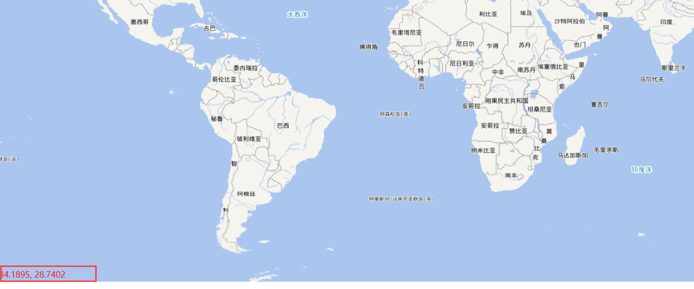

## 6.比例尺控件

 比例尺表示图上距离比实际距离的缩小(或放大程度)，又称为缩尺，比例尺控件位ol.control.ScaleLine，默认显示在地图的左下角

思路：实例化比例尺控件ol.control.ScaleLine，根据需求设置相应参数，然后在map容器中通过controls属性加载比例尺控件

核心代码：

```javascript
//实例化比例尺控件（ScaleLine）
    var scaleLineControl = new ol.control.ScaleLine({
        //设置比例尺单位，degrees、imperial、us、nautical、metric（度量单位）
        units: "metric"
    });
```

通过map容器的controls属性加载比例尺控件

```javascript
//加载比例尺控件
        controls: ol.control.defaults().extend([scaleLineControl])
```

效果：

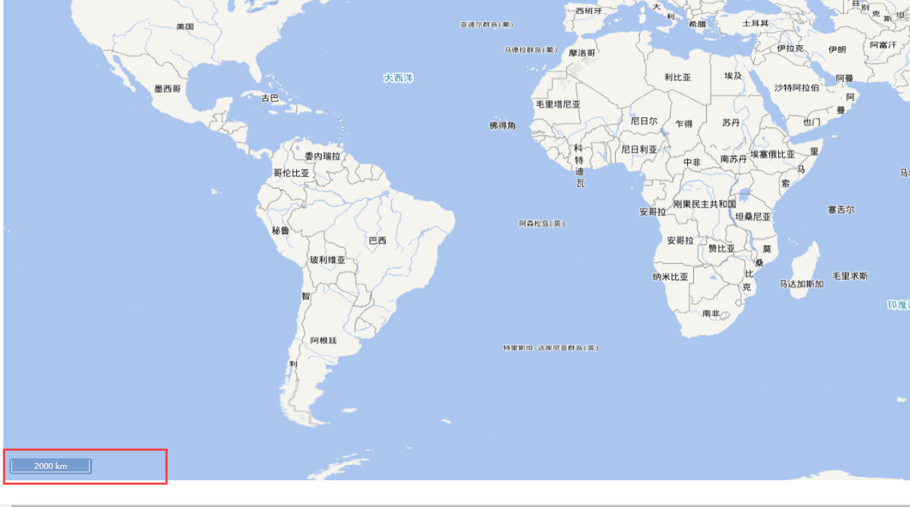

## 7.鹰眼控件

地图鹰眼俗称地图的鸟瞰图或缩略图，对应控件为ol.control.OverviewMap

思路：实例化一个鹰眼控件ol.control.OverviewMap，可以采用默认参数，也可以根据根据应用需求设置其参数，然后通过map的controls参数加载控件，也可以调用map对象的addControl方法加载此控件。

核心代码：

```javascript
//实例化鹰眼控件（OverviewMap）,自定义样式的鹰眼控件
var overviewMapControl = new ol.control.OverviewMap({
    //鹰眼中加载图层，可以与主地图相同，也可以不同
    layers: [
        new ol.layer.Tile({
            title: "天地图矢量图层",
            source: new ol.source.XYZ({
                url: "http://t0.tianditu.com/DataServer?T=vec_w&x={x}&y={y}&l={z}&tk=b74ca9a5dbd96fab6338ab9d239180fb",
                wrapX: false
            })
        }),
        new ol.layer.Tile({
            title: "天地图矢量图层注记",
            source: new ol.source.XYZ({
                url: "http://t0.tianditu.com/DataServer?T=cva_w&x={x}&y={y}&l={z}&tk=b74ca9a5dbd96fab6338ab9d239180fb",
                wrapX: false
            })
        })
    ],
    //鹰眼控件展开时功能按钮上的标识（网页的JS的字符编码）
    collapseLabel: '\u00BB',
    //鹰眼控件折叠时功能按钮上的标识（网页的JS的字符编码）
    label: '\u00AB',
    //初始为展开显示方式
    collapsed: false,
  //鹰眼中视图的设置
    view: new ol.View({
        //地图初始中心点
        center: [0, 0],
        //地图初始显示级别
        zoom: 1,
        //参考系设置
        projection: "EPSG:4326"
    })
});
```

★注意：一定要在鹰眼控件中设置View属性

在map中加载鹰眼控件

```javascript
//加载鹰眼控件
        controls: ol.control.defaults().extend([overviewMapControl])
```

效果：

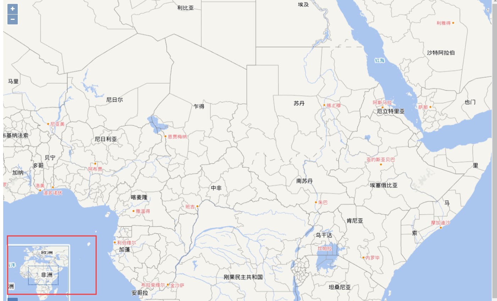

## 8.全屏显示控件

全屏显示控件用于将视图内容放大到全屏显示，可扩大视野范围，便于更好地进行操作，全屏显示控件为ol.control.FullScreen.

思路：实例化一个全屏显示控件，然后通过map的controls参数或者addControl()方法加载到地图容器中

核心代码：

```javascript
controls: ol.control.defaults().extend([
            new ol.control.FullScreen()  //加载全屏显示控件（目前支持非IE内核浏览器）
        ])
```

效果：

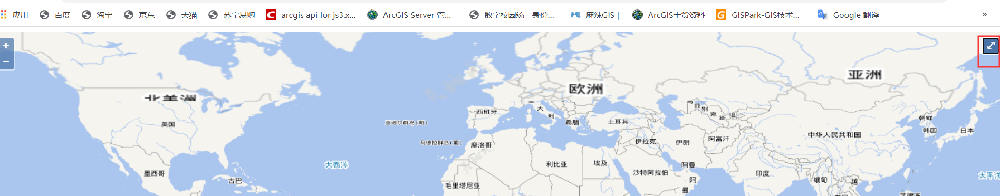

## 9.图层控件

在实际应用中，通常需要将地图容器中加载的图层以列表的形式显示，便于用户查看与操作，Openlayers5封装的控件中并没有提供类似的图层控件，需要自定义实现图层列表功能。

本例中使用列表(ul和li)显示图层名称，并采用复选框控制图层的显示。其中，通过调用图层对象(Layer对象)的get方法获取初始化设置的图层名属性，调用getVisible和setVisible方法控制图层显示。

```html
<div id="mapCon">
    <div id="mouse-position"></div>
    <div id="layerControl" class="layerControl"><!--图层列表容器-->
        <div class="title"><label>图层列表</label></div><!--图层列表的标题-->
        <ul id="layerTree" class="layerTree"></ul><!--图层列表-->
    </div>
</div>
```

代码说明：创建一个ID为layerControl的div层作为图层列表容器，其中通过z-index设置让其显示到地图上层；同时在该图层列表容器中新建一个列表(ID为layerTree的ul)来保存从地图容器中读取的图层。图层列表中的列表项li由脚本程序动态创建。

加载图层列表的脚本代码：

```javascript
	//map中的图层数组
	var layer = new Array();
    //图层名称数组
    var layerName = new Array();
    //图层可见属性数组
    var layerVisibility = new Array();

    /**
     * 加载图层列表数据
     * @param {ol.Map} map 地图对象
     * @param {string} id 图层列表容器ID
     */
    function loadLayersControl(map, id) {
        //图层目录容器
        var treeContent = document.getElementById(id);
        //获取地图中所有图层
        var layers = map.getLayers();
        for (var i = 0; i < layers.getLength() ; i++) {
            //获取每个图层的名称、是否可见属性
            layer[i] = layers.item(i);
            layerName[i] = layer[i].get('name');
            layerVisibility[i] = layer[i].getVisible();
            //新增li元素，用来承载图层项
            var elementLi = document.createElement('li');
            // 添加子节点
            treeContent.appendChild(elementLi);
            //创建复选框元素
            var elementInput = document.createElement('input');
            elementInput.type = "checkbox";
            elementInput.name = "layers";
            elementLi.appendChild(elementInput);
            //创建label元素
            var elementLable = document.createElement('label');
            elementLable.className = "layer";
            //设置图层名称
            setInnerText(elementLable, layerName[i]);
            elementLi.appendChild(elementLable);
            //设置图层默认显示状态
            if (layerVisibility[i]) {
                elementInput.checked = true;
            }
            //为checkbox添加变更事件
            addChangeEvent(elementInput, layer[i]);
        }
    }
    /**
     * 为checkbox元素绑定变更事件
     * @param {input} element checkbox元素
     * @param {ol.layer.Layer} layer 图层对象
     */
    function addChangeEvent(element, layer) {
        element.onclick = function () {
            if (element.checked) {
                //显示图层
                layer.setVisible(true);
            }
            else {
                //不显示图层
                layer.setVisible(false);
            }
        };
    }
    /**
     * 动态设置元素文本内容（兼容）
     */
    function setInnerText(element, text) {
        if (typeof element.textContent == "string") {
            element.textContent = text;
        } else {
            element.innerText = text;
        }
    }
```

调用加载图层列表数据的方法

```javascript
loadLayersControl(map, "layerTree");
```

效果：

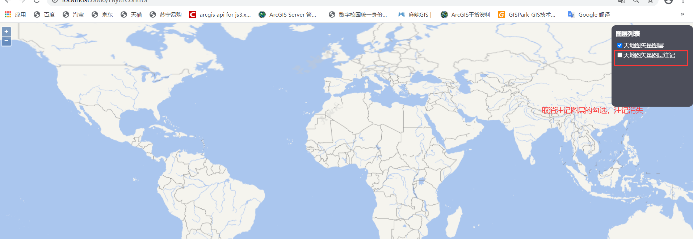

## 10.测量控件

