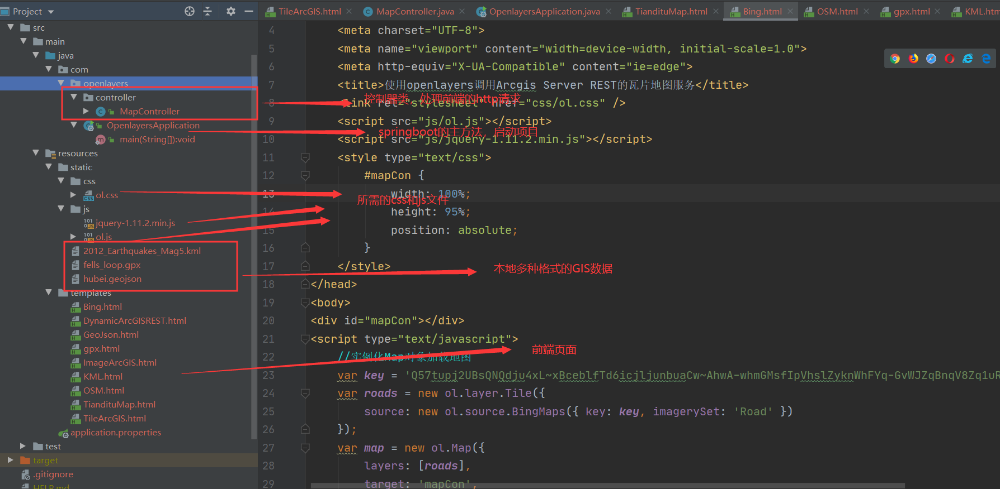
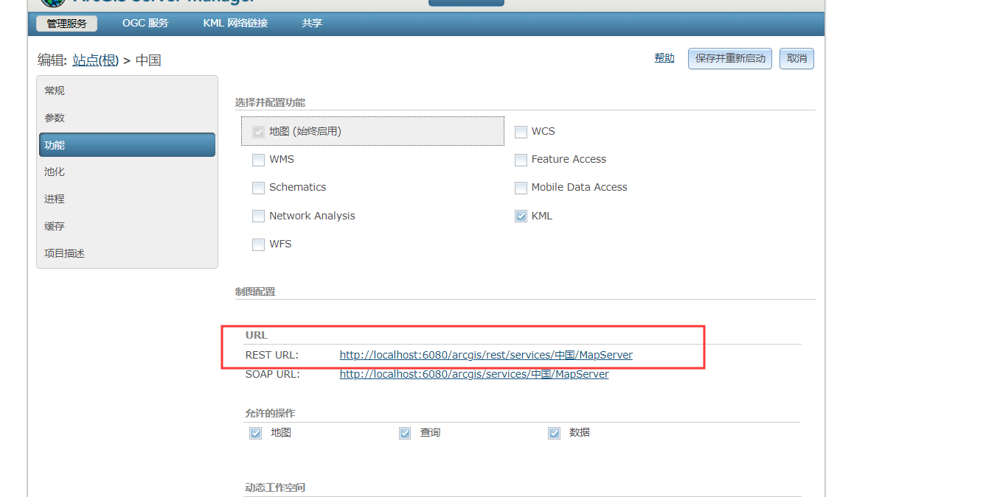
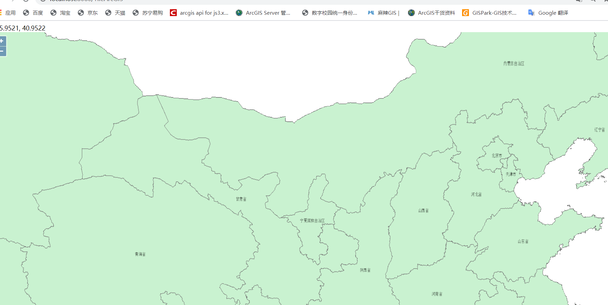
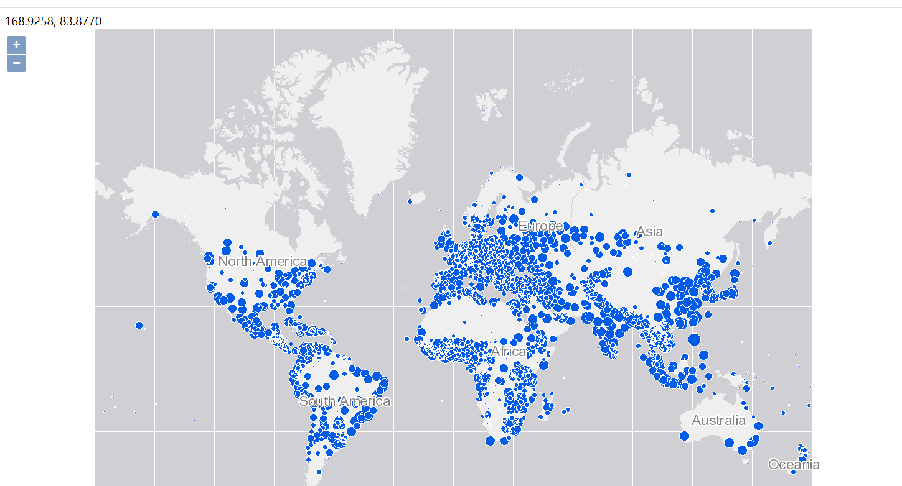
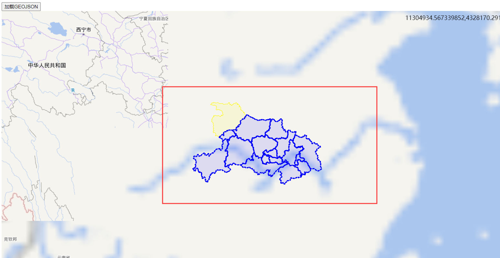

# Openlayers之多源数据展示篇

## 1.Openlayers5加载地图的原理与方法

基于Openlayers5加载地图非常方便，了解Openlayers的几个核心类即可，如地图容器(ol.Map)、图层(ol.layer.Layer及其相关子类)，数据源(ol.source.Source及其相关子类)，以及地图视图(ol.View)

Openlayers5将图层(Layer)和数据源(Source)分离，图层作为渲染地图数据的地图容器，而数据源则为GIS数据的载体。图层(Layer)与数据源(Source)均分为Image,Tile,Vector三大类，在实例化图层时，其数据源要进行相应的设置

(1)瓦片地图

瓦片地图一般使用ol.layer.tile + ol.source.tile这种方式加载，也可以使用ol.layer.Image + ol.source.Image这种方式加载

(2)矢量地图

矢量地图一般使用ol.layer.Vector + ol.source.Vector这种方式加载。矢量地图的数据源一般有两种设置方式，一种为features方法，即设置features参数静态加载矢量地图，或者调用addFeature()或addFeatures()方法动态加载矢量地图；另一种则为url+format方法，即设置矢量地图的url地址与数据格式format来加载矢量地图

项目结构：



## 2.基于Arcgis Server REST的瓦片地图服务接口

思路：通过ol.layer.Tile + ol.source.TileArcGISRest 方式添加Arcgis Server的瓦片数据，通过map.addLayer()方式动态添加

Arcgis Server发布的瓦片服务：



核心代码：

```javascript
//实例化ArcGIS Server REST瓦片地图图层
    var arcGISSource = new ol.source.TileArcGISRest({
        //arcgis server rest 服务瓦片地图服务接口参数的url
        url:'http://localhost:6080/arcgis/rest/services/中国/MapServer',
    });

    var arcGISLayers = new ol.layer.Tile({
        source:arcGISSource
    });

    //添加瓦片图层到地图
    map.addLayer(arcGISLayers);
```

效果：



## 3.基于Arcgis Server REST的矢量地图服务接口

思路：通过ol.layer.Image+ ol.source.ImageArcGISRest的方式添加Arcgis Server发布的矢量地图图层，通过设置map容器的layers参数，将图层加载到创建好的map容器中

核心代码：

```javascript
//Arcgis Server发布的矢量地图服务的REST URL
var url = 'http://localhost:6080/arcgis/rest/services/SampleWorldCities/MapServer';

    var layers = [
        new ol.layer.Image({
            source: new ol.source.ImageArcGISRest({
                ratio: 1,
                params: {},
                url: url
            })
        })
    ];
    var map = new ol.Map({
        layers: layers,
        target: 'map',
        view: new ol.View({
            center: [-10997148, 4569099],
            zoom: 3
        })
    });
```

效果：



## 3.加载GeoJSON数据

加载方式：ol.layer.Vector + ol.source.Vector 

source中使用url+format(解析器)的方式

```javascript
/**
     * 将矢量几何要素显示到地图中
     */
    function loadVectData() {
        if (vectorLayer != null || vectorLayer == "undefined") {
            //移除已有矢量图层
            map.removeLayer(vectorLayer);
        }
        //实例化矢量数据源，用GeoJSON格式的类解析
        var vectorSource = new ol.source.Vector({
            url: "/hubei.geojson",
            format: new ol.format.GeoJSON()
        });
        vectorLayer = new ol.layer.Vector({
            //矢量数据源
            source: vectorSource,
            //样式设置
            style: styleFunction
        });
        //将矢量图层加载到地图中
        map.addLayer(vectorLayer);
        //获取地图视图
        var view = map.getView();
        //平移地图
        view.setCenter([12536865.056410152, 3635008.742201894]);
        //地图缩放
        view.setZoom(6);
    }
```

在Springboot项目中，我们将hubei.geojson放在static目录下，在此处url中直接写 url: "/hubei.geojson"即可

前提是在application.property中配置允许访问静态资源

```properties
#允许访问静态资源
spring.resources.static-locations=classpath:/templates/, classpath:/static/
```

效果：



## 4.加载OpenStreetMap

```javascript
<script type="text/javascript">
    //实例化Map对象加载地图
    var map = new ol.Map({
        //地图容器div的ID
        target: 'mapCon',
        //地图容器中加载的图层
        layers: [
            //加载瓦片图层数据
            new ol.layer.Tile({
                //图层对应数据源，此为加载OpenStreetMap在线瓦片服务数据
                source: new ol.source.OSM()
            })
        ],
        //地图视图设置
        view: new ol.View({
            //地图初始中心点
            center: [0, 0],
            //地图初始显示级别
            zoom: 2
        })
    });
</script>
```

★根据自己数据源学习相应的加载方法即可，思路相同，调不同的API和url即可


