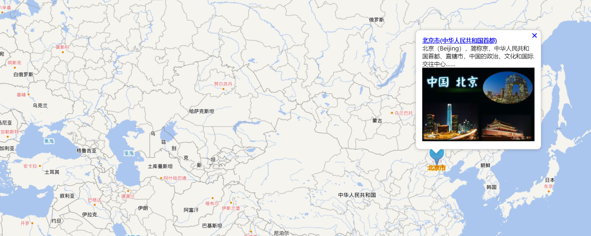

# Openlayers之高级功能篇

## 1.地图标注功能

**地图标注**是将空间位置信息点与地图关联，通过图标、窗口等形式把相关的信息展现到地图上。地图标注也是WebGIS中比较重要的功能之一，在大众应用中较为常见。

地图标注的**基本原理**：获取标注点的空间位置(X、Y逻辑坐标)，在该位置上叠加显示图标(或包含信息的小图片)，必要时以窗口的形式显示详细信息。其中，在获取标注点X，Y的逻辑坐标时要注意，通过鼠标在地图上单击可以得到窗口坐标，一般需要转换为逻辑坐标。

基本API：Openlayers5提供了实现地图标注功能的各类控件与方法，主要是基于叠加层ol.Overlay并结合HTML的网页控件实现的。由于Openlayers5使用独立的样式设置矢量要素信息，提供的ol.style.Icon可以为矢量点图片标识，ol.style.Text类则可以直接设置矢量要素的文本信息。

地图标注的表现形式可以分为3种：**简单的图文标注，冒泡信息窗口标注，聚合标注**

### 1.1图文标注

图片标注是使用图标展现标注点的信息，它是最简单的地图标注形式，也是其他自定义标注的基础。图文标注是通过文本和图标来展现标注点的信息，是一种基本的地图标注形式。

实现思路：

(1)**图片标注**功能一般是使用Openlayers5的**ol.Overlay**结合HTML的一个**div或img标签**元素来实现的。

(2)**文本标注**的实现方式与图片标注类似，首先创建一个ol.Overlay对象，然后关联添加的HTML的text或a标签元素来实现

(3)可以使用加载**矢量点**的方式实现图文标注。设置点要素的图形样式ol.style.Icon，文字样式为ol.style.Text

★通过**矢量点**的方式添加北京市(直接创建一个矢量点要素，通过map.addLayer()加载即可，不需要承载的html元素)：

①通过经纬度创建需要的点

```javascript
var beijing = ol.proj.fromLonLat([116.28, 39.54]);   //北京点
var wuhan = ol.proj.fromLonLat([114.21, 30.37]);    //武汉点
```

②加载天地图

```javascript
 //实例化Map对象加载地图,默认底图加载MapQuest地图
    var map = new ol.Map({
        layers: [
            new ol.layer.Tile({
                title: "天地图矢量图层",
                source: new ol.source.XYZ({
                    url: "http://t0.tianditu.com/DataServer?T=vec_w&x={x}&y={y}&l={z}&tk=b74ca9a5dbd96fab6338ab9d239180fb",
                    wrapX: false
                })
            }),
            new ol.layer.Tile({
                title: "天地图矢量图层注记",
                source: new ol.source.XYZ({
                    url: "http://t0.tianditu.com/DataServer?T=cva_w&x={x}&y={y}&l={z}&tk=b74ca9a5dbd96fab6338ab9d239180fb",
                    wrapX: false
                })
            })
        ],
        //地图容器div的ID
        target: 'mapCon',
        view: new ol.View({
            //地图初始中心点
            center: [130, 39],
            maxZoom: 19,
            minZoom: 1,
            zoom: 1
        })
    });
```

③实例化矢量Vector要素，通过矢量图层的方式加载到地图容器中

```javascript
 //实例化Vector要素，通过矢量图层添加到地图容器中
    var iconFeature = new ol.Feature({   //创建一个矢量要素
        geometry: new ol.geom.Point(beijing),    //为点要素
        //名称属性
        name: '北京市',
        //大概人口数（万）
        population: 2115
    });
    iconFeature.setStyle(createLabelStyle(iconFeature));   //设置样式
    //矢量标注的数据源
    var vectorSource = new ol.source.Vector({
        features: [iconFeature]
    });
    //矢量标注图层
    var vectorLayer = new ol.layer.Vector({
        source: vectorSource
    });
    map.addLayer(vectorLayer);    //通过map.addLayer()动态添加图层
```

其中创建样式的函数为：

```javascript
/**
     * 创建矢量标注样式函数,设置image为图标ol.style.Icon
     * @param {ol.Feature} feature 要素
     */
    var createLabelStyle = function (feature) {
        return new ol.style.Style({
            image: new ol.style.Icon(
                /** @type {olx.style.IconOptions} */
                ({
                    anchor: [0.5, 60],
                    anchorOrigin: 'top-right',
                    anchorXUnits: 'fraction',
                    anchorYUnits: 'pixels',
                    offsetOrigin: 'top-right',
                    // offset:[0,10],
                    //图标缩放比例
                    // scale:0.5,
                    //透明度
                    opacity: 0.75,
                    //图标的url   
                    src: 'blueIcon.png'    
                })),
            text: new ol.style.Text({
                //位置
                textAlign: 'center',
                //基准线
                textBaseline: 'middle',
                //文字样式
                font: 'normal 14px 微软雅黑',
                //文本内容
                text: feature.get('name'),
                //文本填充样式（即文字颜色）
                fill: new ol.style.Fill({ color: '#aa3300' }),
                stroke: new ol.style.Stroke({ color: '#ffcc33', width: 2 })
            })
        });
    }
```

图片的Url设置为 src: 'blueIcon.png' ，springboot直接放在static目录下即可

效果为：


 ★通过ol.Overlay实现图片标注和文本标注的功能，图片标注通过ol.Overlay结合一个div元素实现，文本标注通过ol.Overlay结合一个a标签实现

```javascript
// 实例化overlay标注，添加到地图容器中
    var marker = new ol.Overlay({
        position: wuhan,
        positioning: 'center-center',
        element: document.getElementById('marker'),    //承载ol.Overlay的html元素
        stopEvent: false
    });
    map.addOverlay(marker);
    marker.getElement().title = "武汉市";
    var text = new ol.Overlay({
        position: wuhan,
        element: document.getElementById('address')
    });
    map.addOverlay(text);
    text.getElement().innerText = marker.getElement().title;
```

效果：


★通过鼠标点击添加标注

用复选框决定是画矢量Vector要素，还是覆盖层ol.Overlay要素

```html
<div id="menu">
    选择标注类型后用鼠标在地图上点击添加标注：
    <label class="checkbox"><input type="radio" name="label" value="vector" />Vector Labels</label>
    <label class="checkbox"><input type="radio" name="label" value="overlay" />Overlay Labels</label>
</div>
```

为地图添加单击事件

```javascript
//为地图容器添加单击事件监听
    map.on('click', function (evt) {
        var type = $("input[name='label']:checked").val();
        //鼠标单击点坐标
        var point = evt.coordinate;
        if (type == "vector") {
            //添加一个新的标注（矢量要素）
            addVectorLabel(point);
        }
        else if (type == "overlay") {
            //添加新的图文标注（overlay标注）
            addOverlayLabel(point);
        }
    });
```

添加矢量要素的函数

```javascript

    /**
     * 添加一个新的标注（矢量要素）
     * @param {ol.Coordinate} coordinate 坐标点
     */
    function addVectorLabel(coordinate) {
        //新建一个要素 ol.Feature
        var newFeature = new ol.Feature({
            //几何信息
            geometry: new ol.geom.Point(coordinate),
            //名称属性
            name: '标注点'
        });
        //设置要素的样式
        newFeature.setStyle(createLabelStyle(newFeature));
        //将新要素添加到数据源中
        vectorSource.addFeature(newFeature);
    }
```

添加ol.Overlay图文标注

```javascript
 /**
     * 添加一个新的图文标注（overlay标注）
     * @param {ol.Coordinate} coordinate 坐标点
     */
    function addOverlayLabel(coordinate) {
        //新增div元素
        var elementDiv = document.createElement('div');
        elementDiv.className = "marker";
        elementDiv.title = "标注点";
        // 获取id为label的元素
        var overlay = document.getElementById('label');
        // 为ID为label的div层添加div子节点
        overlay.appendChild(elementDiv);
        //新增a元素
        var elementA = document.createElement("a");
        elementA.className = "address";
        elementA.href = "#";
        //设置文本
        setInnerText(elementA, elementDiv.title);
        // 新建的div元素添加a子节点
        elementDiv.appendChild(elementA);

        //实例化图文标注（图形+文本），添加到地图容器中
        var newMarker = new ol.Overlay({
            position: coordinate,
            positioning: 'center-center',
            element: elementDiv,
            stopEvent: false
        });
        map.addOverlay(newMarker);
        var newText = new ol.Overlay({
            position: coordinate,
            element: elementA
        });
        map.addOverlay(newText);
    }

    /**
     * 动态设置元素文本内容（兼容）
     **/
    function setInnerText(element, text) {
        if (typeof element.textContent == "string") {
            element.textContent = text;
        } else {
            element.innerText = text;
        }
    }
```

效果：


### 1.2 Popup标注

**Popup标注**是通过**冒泡方式**显示标注点的详细信息的，一般结合基本标注点使用。Popup标注比较灵活，可以结合HTML、CSS等自定义标注信息的展现样式，在弹出框中描述标注点的详细信息。

代码：

```html
<!DOCTYPE html>
<html lang="en">
<head>
    <meta charset="UTF-8">
    <link href="css/ol.css" rel="stylesheet" type="text/css">
    <script src="js/ol.js" type="text/javascript"></script>
    <script src="js/jquery-1.11.2.min.js" type="text/javascript"></script>
    <title>Popup</title>
    <style type="text/css">
        body, html {
            border: none;
            padding: 0;
            margin: 0;
        }

        #menu {
            width: 100%;
            height: 20px;
            padding: 5px 10px;
            font-size: 14px;
            font-family: "微软雅黑";
            left: 10px;
            text-align: center;
        }

        #mapCon {
            width: 100%;
            height: 95%;
            position: absolute;
        }

        .ol-popup {
            position: absolute;
            background-color: white;
            -webkit-filter: drop-shadow(0 1px 4px rgba(0,0,0,0.2));
            filter: drop-shadow(0 1px 4px rgba(0,0,0,0.2));
            padding: 15px;
            border-radius: 10px;
            border: 1px solid #cccccc;
            bottom: 45px;
            left: -50px;
        }

        .ol-popup:after, .ol-popup:before {
            top: 100%;
            border: solid transparent;
            content: " ";
            height: 0;
            width: 0;
            position: absolute;
            pointer-events: none;
        }

        .ol-popup:after {
            border-top-color: white;
            border-width: 10px;
            left: 48px;
            margin-left: -10px;
        }

        .ol-popup:before {
            border-top-color: #cccccc;
            border-width: 11px;
            left: 48px;
            margin-left: -11px;
        }

        .ol-popup-closer {
            text-decoration: none;
            position: absolute;
            top: 2px;
            right: 8px;
        }

        .ol-popup-closer:after {
            content: "✖";
        }

        #popup-content {
            font-size: 14px;
            font-family: "微软雅黑";
        }

        #popup-content .markerInfo {
            font-weight: bold;
        }
    </style>
</head>
<body>
<div id="menu" style="font-weight:bold">
    鼠标单击标注点，弹出Popup标注
</div>
<div id="mapCon">
    <!-- Popup -->
    <div id="popup" class="ol-popup">
        <a href="#" id="popup-closer" class="ol-popup-closer"></a>
        <div id="popup-content">
        </div>
    </div>
</div>
<script type="text/javascript">
    var beijing =  ol.proj.fromLonLat([116.28, 39.54]);
    //示例标注点北京市的信息对象
    var featuerInfo = {
        geo: beijing,
        att: {
            //标注信息的标题内容
            title: "北京市(中华人民共和国首都)",
            //标注详细信息链接
            titleURL: "http://www.openlayers.org/",
            //标注内容简介
            text: "北京（Beijing），简称京，中华人民共和国首都、直辖市，中国的政治、文化和国际交往中心……",
            //标注的图片
            imgURL: "bj1.png"
        }
    }

    /**
     * 实例化Map对象加载地图,默认底图加载MapQuest地图
     */
    var map = new ol.Map({
        layers: [
            new ol.layer.Tile({
                title: "天地图矢量图层",
                source: new ol.source.XYZ({
                    url: "http://t0.tianditu.com/DataServer?T=vec_w&x={x}&y={y}&l={z}&tk=b74ca9a5dbd96fab6338ab9d239180fb",
                    wrapX: false
                })
            }),
            new ol.layer.Tile({
                title: "天地图矢量图层注记",
                source: new ol.source.XYZ({
                    url: "http://t0.tianditu.com/DataServer?T=cva_w&x={x}&y={y}&l={z}&tk=b74ca9a5dbd96fab6338ab9d239180fb",
                    wrapX: false
                })
            })
        ],
        target: 'mapCon',
        view: new ol.View({
            center: [116.28, 39.54],
            zoom: 2
        })
    });

    /**
     * 创建标注样式函数,设置image为图标ol.style.Icon
     * @param {ol.Feature} feature 要素
     */
    var createLabelStyle = function (feature) {
        return new ol.style.Style({
            image: new ol.style.Icon(
                /** @type {olx.style.IconOptions} */
                ({
                    //设置图标点
                    anchor: [0.5, 60],
                    //图标起点
                    anchorOrigin: 'top-right',
                    //指定x值为图标点的x值
                    anchorXUnits: 'fraction',
                    //指定Y值为像素的值
                    anchorYUnits: 'pixels',
                    //偏移
                    offsetOrigin: 'top-right',
                    // offset:[0,10],
                    //图标缩放比例
                    // scale:0.5,
                    //透明度
                    opacity: 0.75,
                    //图标的url
                    src: 'blueIcon.png'
                })),
            text: new ol.style.Text({
                //位置
                textAlign: 'center',
                //基准线
                textBaseline: 'middle',
                //文字样式
                font: 'normal 14px 微软雅黑',
                //文本内容
                text: feature.get('name'),
                //文本填充样式（即文字颜色）
                fill: new ol.style.Fill({ color: '#aa3300' }),
                stroke: new ol.style.Stroke({ color: '#ffcc33', width: 2 })
            })
        });
    }

    //实例化Vector要素，通过矢量图层添加到地图容器中
    var iconFeature = new ol.Feature({
        //坐标点
        geometry: new ol.geom.Point(beijing),
        //名称属性
        name: '北京市',
        //大概人口数（万）
        population: 2115
    });
    iconFeature.setStyle(createLabelStyle(iconFeature));
    //矢量标注的数据源
    var vectorSource = new ol.source.Vector({
        features: [iconFeature]
    });
    //矢量标注图层
    var vectorLayer = new ol.layer.Vector({
        source: vectorSource
    });
    map.addLayer(vectorLayer);

    /**
     * 实现popup的html元素
     */
    var container = document.getElementById('popup');
    var content = document.getElementById('popup-content');
    var closer = document.getElementById('popup-closer');

    /**
     * 在地图容器中创建一个Overlay
     */
    var popup = new ol.Overlay(
        /** @type {olx.OverlayOptions} */
        ({
            //要转换成overlay的HTML元素
            element: container,
            //当前窗口可见
            autoPan: true,
            //Popup放置的位置
            positioning: 'bottom-center',
            //是否应该停止事件传播到地图窗口
            stopEvent: false,
            autoPanAnimation: {
                //当Popup超出地图边界时，为了Popup全部可见，地图移动的速度
                duration: 250
            }
        }));
    map.addOverlay(popup);

    /**
     * 添加关闭按钮的单击事件（隐藏popup）
     * @return {boolean} Don't follow the href.
     */
    closer.onclick = function () {
        //未定义popup位置
        popup.setPosition(undefined);
        //失去焦点
        closer.blur();
        return false;
    };

    /**
     * 动态创建popup的具体内容
     * @param {string} title
     */
    function addFeatrueInfo(info) {
        //新增a元素
        var elementA = document.createElement('a');
        elementA.className = "markerInfo";
        elementA.href = info.att.titleURL;
        //elementA.innerText = info.att.title;
        setInnerText(elementA, info.att.title);
        // 新建的div元素添加a子节点
        content.appendChild(elementA);
        //新增div元素
        var elementDiv = document.createElement('div');
        elementDiv.className = "markerText";
        //elementDiv.innerText = info.att.text;
        setInnerText(elementDiv, info.att.text);
        // 为content添加div子节点
        content.appendChild(elementDiv);
        //新增img元素
        var elementImg = document.createElement('img');
        elementImg.className = "markerImg";
        elementImg.src = info.att.imgURL;
        // 为content添加img子节点
        content.appendChild(elementImg);
    }
    /**
     * 动态设置元素文本内容（兼容）
     */
    function setInnerText(element, text) {
        if (typeof element.textContent == "string") {
            element.textContent = text;
        } else {
            element.innerText = text;
        }
    }

    /**
     * 为map添加点击事件监听，渲染弹出popup
     */
    map.on('click', function (evt) {
        //判断当前单击处是否有要素，捕获到要素时弹出popup
        var feature = map.forEachFeatureAtPixel(evt.pixel, function (feature, layer) { return feature; });
        if (feature) {
            //清空popup的内容容器
            content.innerHTML = '';
            //在popup中加载当前要素的具体信息
            addFeatrueInfo(featuerInfo);
            if (popup.getPosition() == undefined) {
                //设置popup的位置
                popup.setPosition(featuerInfo.geo);
            }
        }
    });
    /**
     * 为map添加鼠标移动事件监听，当指向标注时改变鼠标光标状态
     */
    map.on('pointermove', function (e) {
        var pixel = map.getEventPixel(e.originalEvent);
        var hit = map.hasFeatureAtPixel(pixel);
        map.getTargetElement().style.cursor = hit ? 'pointer' : '';
    });
</script>
</body>
</html>
```

效果：

