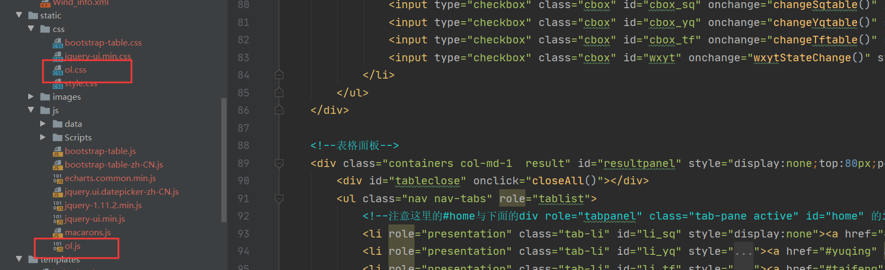
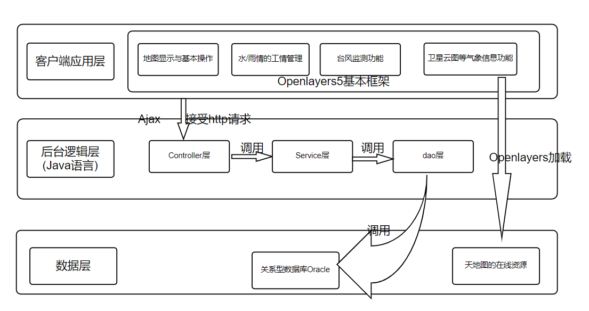
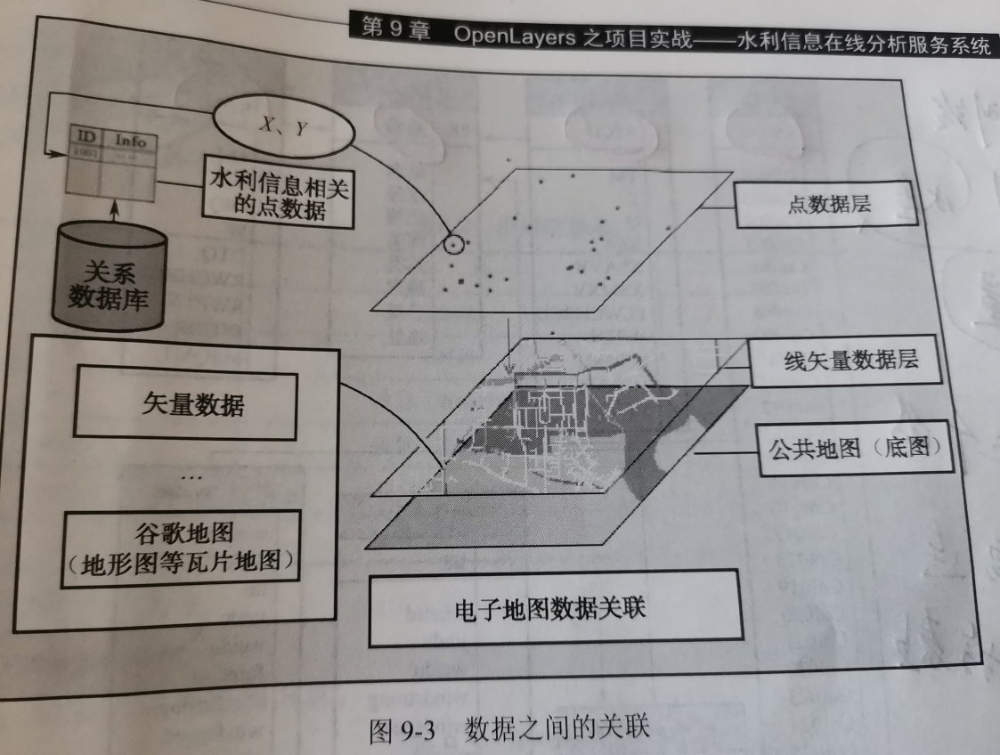
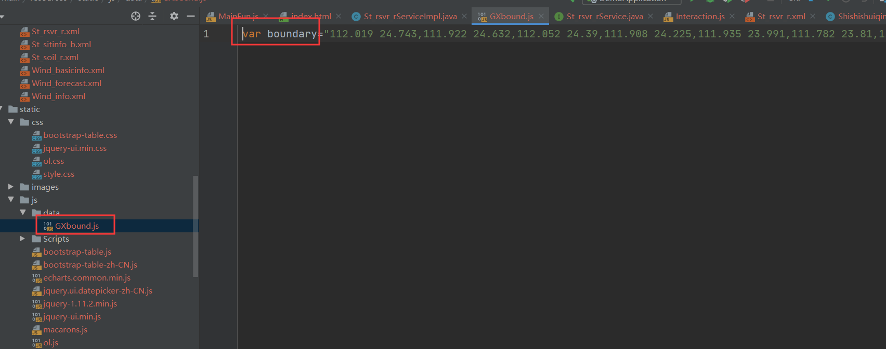
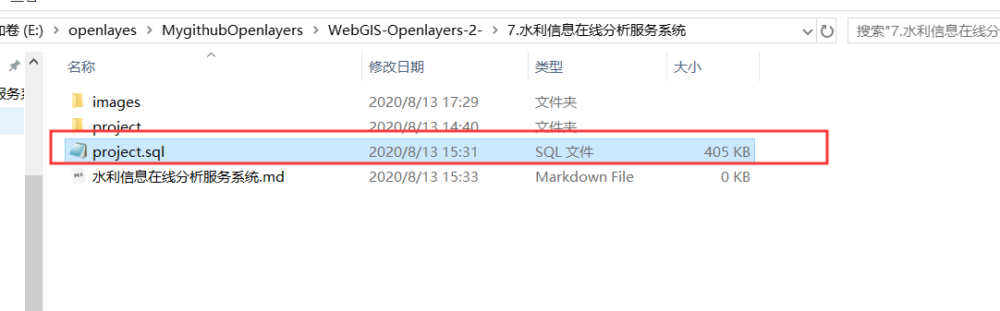
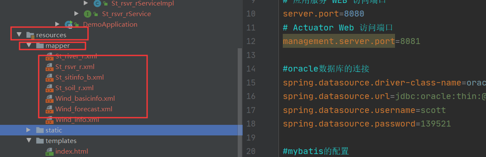
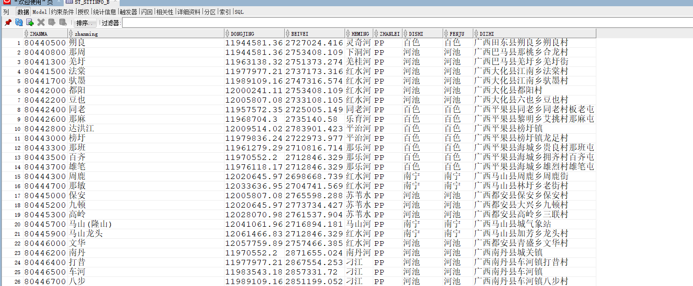
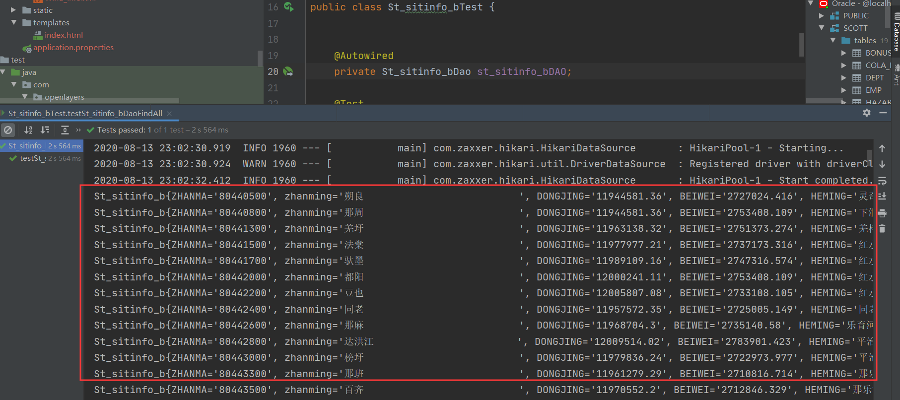

# Openlayers之项目实战——水利信息在线分析服务系统

## 1.项目简介

本项目介绍的水利信息在线分析服务系统，采用**广西**壮族自治区的水利信息相关数据，结合GIS的使用，通过地图标注、图表与动态推演等方式，直观模拟展现广西壮族自治区当前的**水情**、**雨情**状况，以及**台风**情况。

## 2.系统需求

三大功能：

(1)**工情查询**：水情信息、雨情信息的实时查询统计，以及地图标注定位，可以直观掌握每个水/雨情监测站点的水/雨情数据，全面掌握各地区的水情以及降雨情况。

(2)**台风管理**：查询区域范围内相关的台风信息，即台风路径的查询以及线路的轨迹回放，根据台风数据确定相应的应对方案

(3)**气象信息**：气象信息是影响水利工作的一个重要内容，相关部门可以对区域气象预报，卫星云图变化走势等数据进行分析，为防旱防涝工作提供辅助决策。

## 3.系统设计

### 3.1系统开发模式

springboot进行项目开发，在其静态文件夹static中引入openlayers的js文件和css文件即可使用openlayers



### 3.2项目的体系架构

该系统**空间数据**为公共地图服务(天地图)，**业务数据**为与水利信息相关的业务数据，客户端(**前端**)使用openlayers5框架，**后端**使用Java技术体系，最终构建成一个具有以下功能的WebGIS系统：

①地图显示与基本操作

②水/雨情信息的工情管理

③台风监测功能

④卫星云图气象信息功能

系统架构图为：



###  3.3系统功能


具体功能在项目中结合可视化界面和代码逻辑说明

## 4.数据组织设计

本项目涉及两大类数据：空间数据和属性数据

**空间数据**：系统使用天地图(矢量底图)作为底图，上层叠加水利信息相关的矢量点数据。

数据之间的关联：天地图为底图，上面叠加广西边界的数据(储存在项目中)，再叠加水库/河流的矢量点(存储在关系型数据库oracle中)



广西边界数据：



5.数据库设计

sql文件(oracle)位置：



st_sitinfo_b：监测站点信息表

st_rsvr_r：水库信息表

st_river_r：河流信息表

一个监测站点，对应多个水库，一个水库属于一个监测站点，为一对多的关系

一个监测站点，对应多个河流，一个河流属于一个监测站点，为一对多的关系

st_soil_r：雨量信息表

一个监测站点，对应多个雨量，一个雨量属于一个监测站点，为一对多的关系

wind_basicinfo：台风基本信息表

wind_info：台风详细信息表

wind_forecast：台风预测信息表

由于我们dao层技术使用的是mybatis，所以尽量让数据库中表的名字和java实体类中的类名相同，其中对应的字段名也应该相同，可以方便我们之后的开发。(不相同也没关系，我们可以在mybatis的mapper配置文件中进行对应匹配)。

java中实体类如下：

st_sitinfo_b：

```java
//监测站点信息表
@Repository
public class St_sitinfo_b {


    private String ZHANMA;  //站码
    private String zhanming; //站名
    private String DONGJING;  //东经
    private String BEIWEI;  //北纬
    private String HEMING;   //河名
    private String ZHANLEI;  //站类
    private String DISHI;  //地市
    private String FENJU;   //分局
    private String DIZHI;   //地址
  //省略无参有参构造器、getset方法、toString()方法
```

st_rsvr_r：

```java
@Repository
public class St_rsvr_r {

    private String STCD;  //站码
    private String TM;  //时间
    private String RZ;  //水位
    private String INQ;   //流量
    private String OTQ;   //保证/正常
    private String W;   //警戒

    //一个水库对应1个监测站点，一个监测站点有多个水库
    private St_sitinfo_b st_sitinfo_b;
  //省略无参有参构造器、getset方法、toString()方法
```

st_river_r：

```java
//河流信息表
//一条河流对应一个监测站点，一个监测站点对应多条河流，将监测站点放入河流中
@Repository
public class St_river_r {

    private String STCD;   //站码
    private String TM;    //时间
    private String RZ;   //水位
    private String OTQ;   //保证/正常
    private St_sitinfo_b st_sitinfo_b;   //监测站点
   //省略无参有参构造器、getset方法、toString()方法
```

st_soil_r：

```java
//雨量信息表
//一个雨量信息属于一个监测站点，一个监测站点包含多个雨量信息
@Repository
public class St_soil_r {

    private String COL001;  //站码
    private Date COL002;    //时间
    private Float COL007;   //雨量
    private St_sitinfo_b st_sitinfo_b;   //监测站点
  //省略无参有参构造器、getset方法、toString()方法
```

wind_basicinfo：

```java
//台风基本信息表
@Repository
public class Wind_basicInfo {

    private int WINDID;   //台风编号
    private String WINDNAME;    //台风中文名称
    private String WINDEND;   //台风英文名称
  //省略无参有参构造器、getset方法、toString()方法
```

wind_info：

```java
//台风详细信息表
@Repository
public class Wind_info {

    private int WINDID;   //台风编号
    private String TM;     //时间
    private float JINDU;    //经度
    private float WEIDU;     //纬度
    private String WINDSTRONG;   //风力
    private String WINDSPEED;    //风速
    private String QIYA;    //气压
    private String MOVESPEED;    //移动风速
    private String MOVEDIRECT;    //风向
    private int SEVRADIUS;     //半径1
    private int TENRADIUS;    //半径2
   //省略无参有参构造器、getset方法、toString()方法
```

wind_forecast：

```java
//台风预测信息表
@Repository
public class Wind_forecast {

    private int WINDID;  //台风编号
    private String FORECAST;    //预报国家
    private Date TM;    //时间
    private float JINDU;    //经度
    private float WEIDU;   //纬度
    private String WINDSTRONG;    //风力
    private String WINDSPEED;   //风速
    private String QIYA;   //气压
    private String MOVESPEED;   //移动风速
    private String MOVEDIRECT;   //风向
    private int SEVRADIUS;    //半径1
    private int TENRADIUS;    //半径2
    //省略无参有参构造器、getset方法、toString()方法
```

## 5.springboot整合mybatis完成对所有表的增删改查

MyBatis 框架是一个持久层框架，是 Apache 下的顶级项目。**Mybatis 可以让开发者的主要精力放在 sql 上，通过 Mybatis 提供的映射方式，自由灵活的生成满足需要的 sql 语句。**使用简单的 XML 或注解来配置和映射原生信息，将接口和 Java 的 POJOs 映射成数据库中的记录。

springboot整合mybatis的步骤：

(1)导入mybatis和数据库的相关依赖

```xml
<!--oracle的相关依赖-->
<dependency>
    <groupId>com.oracle.ojdbc</groupId>
    <artifactId>ojdbc8</artifactId>
    <scope>runtime</scope>
</dependency>
<!--mybatis的相关依赖-->
<dependency>
    <groupId>org.mybatis.spring.boot</groupId>
    <artifactId>mybatis-spring-boot-starter</artifactId>
    <version>1.3.0</version>
</dependency>
```

(2)在application.properties中进行相关配置

```properties
#oracle数据库的连接
spring.datasource.driver-class-name=oracle.jdbc.driver.OracleDriver
spring.datasource.url=jdbc:oracle:thin:@localhost:1521:orcl
spring.datasource.username=scott
spring.datasource.password=139521

#mybatis的配置
#指定别名
mybatis.type-aliases-package=com.openlayers.action.entity
#驼峰命名规范
mybatis.configuration.map-underscore-to-camel-case=true
#mapper映射文件位置
mybatis.mapper-locations=classpath:mapper/*.xml
```

映射文件的位置：在类路径(resources)下的mapper文件夹下的.xml文件



(3)基于xml文件的整合

例如：监测站点st_sitinfo_b信息查询

数据库：



实体类对应St_sitinfo_b(实体类中的属性名称与数据库中的字段名称保持一致)

St_sitinfo_bDao的写法：

```java
//监测站点的dao
@Repository    //该类注入spring容器
@Mapper   //让spring容器知道这是一个mapper类
public interface St_sitinfo_bDao {

    //查询所有监测站点信息
    List<St_sitinfo_b> findAll();
    
}
```

★**@Mapper**注解：让spring容器知道这是一个mapper类，可以不写.xml文件，直接在方法上使用@Select注解写sql语句，但是当sql语句较复杂时，写xml文件比较易读。

.xml文件的写法

```xml
<?xml version="1.0" encoding="UTF-8"?>
<!DOCTYPE mapper PUBLIC "-//mybatis.org//DTD Mapper 3.0//EN" "http://mybatis.org/dtd/mybatis-3-mapper.dtd">
<mapper namespace="com.openlayers.action.dao.St_sitinfo_bDao"><!--命名空间-->

    <select id="findAll" resultType="st_sitinfo_b"><!--方法名和返回值的封装-->
        select * from ST_SITINFO_B
    </select>

</mapper>
```

测试类的写法：

```java
package com.openlayers.action.MybatisTest.daoTest;

import com.openlayers.action.dao.St_sitinfo_bDao;
import com.openlayers.action.entity.St_sitinfo_b;
import org.junit.Test;
import org.junit.runner.RunWith;
import org.springframework.beans.factory.annotation.Autowired;
import org.springframework.boot.test.context.SpringBootTest;
import org.springframework.test.context.junit4.SpringRunner;


import java.util.List;

@RunWith(SpringRunner.class)
@SpringBootTest
public class St_sitinfo_bTest {


    @Autowired
    private St_sitinfo_bDao st_sitinfo_bDAO;

    @Test
    public void testSt_sitinfo_bDaoFindAll() {
        List<St_sitinfo_b> st_sitinfo_bs = st_sitinfo_bDAO.findAll();
        for (St_sitinfo_b st_sitinfo_b : st_sitinfo_bs) {
            System.out.println(st_sitinfo_b);
        }
    }

}
```

测试结果：



此例子为最简单的mybatis的使用，后面涉及一对多的写法，在前端调用时再贴出代码。

## 6.系统环境说明

