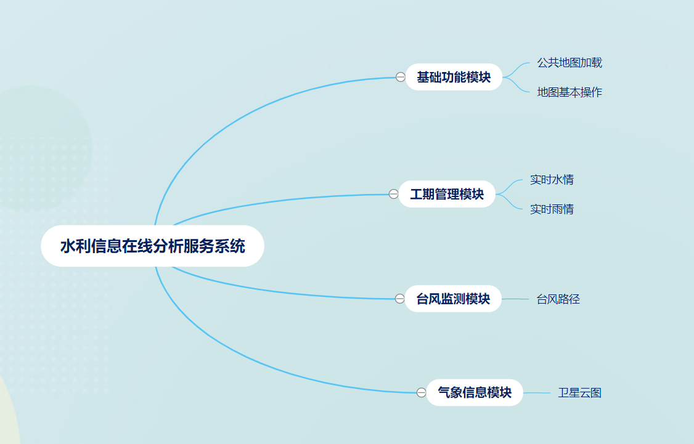

# Openlayers之项目实战——水利信息在线分析服务系统

## 1.项目简介

本项目介绍的水利信息在线分析服务系统，采用**广西**壮族自治区的水利信息相关数据，结合GIS的使用，通过地图标注、图表与动态推演等方式，直观模拟展现广西壮族自治区当前的**水情**、**雨情**状况，以及**台风**情况。

## 2.系统需求

三大功能：

(1)**工情查询**：水情信息、雨情信息的实时查询统计，以及地图标注定位，可以直观掌握每个水/雨情监测站点的水/雨情数据，全面掌握各地区的水情以及降雨情况。

(2)**台风管理**：查询区域范围内相关的台风信息，即台风路径的查询以及线路的轨迹回放，根据台风数据确定相应的应对方案

(3)**气象信息**：气象信息是影响水利工作的一个重要内容，相关部门可以对区域气象预报，卫星云图变化走势等数据进行分析，为防旱防涝工作提供辅助决策。

## 3.系统设计

### 3.1系统开发模式

springboot进行项目开发，在其静态文件夹static中引入openlayers的js文件和css文件即可使用openlayers


### 3.2项目的体系架构

该系统**空间数据**为公共地图服务(天地图)，**业务数据**为与水利信息相关的业务数据，客户端(**前端**)使用openlayers5框架，**后端**使用Java技术体系，最终构建成一个具有以下功能的WebGIS系统：

①地图显示与基本操作

②水/雨情信息的工情管理

③台风监测功能

④卫星云图气象信息功能

系统架构图为：


###  3.3系统功能



具体功能在项目中结合可视化界面和代码逻辑说明

## 4.数据组织设计

本项目涉及两大类数据：空间数据和属性数据

**空间数据**：系统使用天地图(矢量底图)作为底图，上层叠加水利信息相关的矢量点数据。

数据之间的关联：天地图为底图，上面叠加广西边界的数据(储存在项目中)，再叠加水库/河流的矢量点(存储在关系型数据库oracle中)


广西边界数据：


5.数据库设计

sql文件(oracle)位置：


st_sitinfo_b：监测站点信息表

st_rsvr_r：水库信息表

st_river_r：河流信息表

一个监测站点，对应多个水库，一个水库属于一个监测站点，为一对多的关系

一个监测站点，对应多个河流，一个河流属于一个监测站点，为一对多的关系

st_soil_r：雨量信息表

一个监测站点，对应多个雨量，一个雨量属于一个监测站点，为一对多的关系

wind_basicinfo：台风基本信息表

wind_info：台风详细信息表

wind_forecast：台风预测信息表

由于我们dao层技术使用的是mybatis，所以尽量让数据库中表的名字和java实体类中的类名相同，其中对应的字段名也应该相同，可以方便我们之后的开发。(不相同也没关系，我们可以在mybatis的mapper配置文件中进行对应匹配)。

java中实体类如下：

st_sitinfo_b：

```java
//监测站点信息表
@Repository
public class St_sitinfo_b {


    private String ZHANMA;  //站码
    private String zhanming; //站名
    private String DONGJING;  //东经
    private String BEIWEI;  //北纬
    private String HEMING;   //河名
    private String ZHANLEI;  //站类
    private String DISHI;  //地市
    private String FENJU;   //分局
    private String DIZHI;   //地址
  //省略无参有参构造器、getset方法、toString()方法
```

st_rsvr_r：

```java
@Repository
public class St_rsvr_r {

    private String STCD;  //站码
    private String TM;  //时间
    private String RZ;  //水位
    private String INQ;   //流量
    private String OTQ;   //保证/正常
    private String W;   //警戒

    //一个水库对应1个监测站点，一个监测站点有多个水库
    private St_sitinfo_b st_sitinfo_b;
  //省略无参有参构造器、getset方法、toString()方法
```

st_river_r：

```java
//河流信息表
//一条河流对应一个监测站点，一个监测站点对应多条河流，将监测站点放入河流中
@Repository
public class St_river_r {

    private String STCD;   //站码
    private String TM;    //时间
    private String RZ;   //水位
    private String OTQ;   //保证/正常
    private St_sitinfo_b st_sitinfo_b;   //监测站点
   //省略无参有参构造器、getset方法、toString()方法
```

st_soil_r：

```java
//雨量信息表
//一个雨量信息属于一个监测站点，一个监测站点包含多个雨量信息
@Repository
public class St_soil_r {

    private String COL001;  //站码
    private Date COL002;    //时间
    private Float COL007;   //雨量
    private St_sitinfo_b st_sitinfo_b;   //监测站点
  //省略无参有参构造器、getset方法、toString()方法
```

wind_basicinfo：

```java
//台风基本信息表
@Repository
public class Wind_basicInfo {

    private int WINDID;   //台风编号
    private String WINDNAME;    //台风中文名称
    private String WINDEND;   //台风英文名称
  //省略无参有参构造器、getset方法、toString()方法
```

wind_info：

```java
//台风详细信息表
@Repository
public class Wind_info {

    private int WINDID;   //台风编号
    private String TM;     //时间
    private float JINDU;    //经度
    private float WEIDU;     //纬度
    private String WINDSTRONG;   //风力
    private String WINDSPEED;    //风速
    private String QIYA;    //气压
    private String MOVESPEED;    //移动风速
    private String MOVEDIRECT;    //风向
    private int SEVRADIUS;     //半径1
    private int TENRADIUS;    //半径2
   //省略无参有参构造器、getset方法、toString()方法
```

wind_forecast：

```java
//台风预测信息表
@Repository
public class Wind_forecast {

    private int WINDID;  //台风编号
    private String FORECAST;    //预报国家
    private Date TM;    //时间
    private float JINDU;    //经度
    private float WEIDU;   //纬度
    private String WINDSTRONG;    //风力
    private String WINDSPEED;   //风速
    private String QIYA;   //气压
    private String MOVESPEED;   //移动风速
    private String MOVEDIRECT;   //风向
    private int SEVRADIUS;    //半径1
    private int TENRADIUS;    //半径2
    //省略无参有参构造器、getset方法、toString()方法
```

## 5.springboot整合mybatis完成对所有表的增删改查

MyBatis 框架是一个持久层框架，是 Apache 下的顶级项目。**Mybatis 可以让开发者的主要精力放在 sql 上，通过 Mybatis 提供的映射方式，自由灵活的生成满足需要的 sql 语句。**使用简单的 XML 或注解来配置和映射原生信息，将接口和 Java 的 POJOs 映射成数据库中的记录。

springboot整合mybatis的步骤：

(1)导入mybatis和数据库的相关依赖

```xml
<!--oracle的相关依赖-->
<dependency>
    <groupId>com.oracle.ojdbc</groupId>
    <artifactId>ojdbc8</artifactId>
    <scope>runtime</scope>
</dependency>
<!--mybatis的相关依赖-->
<dependency>
    <groupId>org.mybatis.spring.boot</groupId>
    <artifactId>mybatis-spring-boot-starter</artifactId>
    <version>1.3.0</version>
</dependency>
```

(2)在application.properties中进行相关配置

```properties
#oracle数据库的连接
spring.datasource.driver-class-name=oracle.jdbc.driver.OracleDriver
spring.datasource.url=jdbc:oracle:thin:@localhost:1521:orcl
spring.datasource.username=scott
spring.datasource.password=139521

#mybatis的配置
#指定别名
mybatis.type-aliases-package=com.openlayers.action.entity
#驼峰命名规范
mybatis.configuration.map-underscore-to-camel-case=true
#mapper映射文件位置
mybatis.mapper-locations=classpath:mapper/*.xml
```

映射文件的位置：在类路径(resources)下的mapper文件夹下的.xml文件


(3)基于xml文件的整合

例如：监测站点st_sitinfo_b信息查询

数据库：


实体类对应St_sitinfo_b(实体类中的属性名称与数据库中的字段名称保持一致)

St_sitinfo_bDao的写法：

```java
//监测站点的dao
@Repository    //该类注入spring容器
@Mapper   //让spring容器知道这是一个mapper类
public interface St_sitinfo_bDao {

    //查询所有监测站点信息
    List<St_sitinfo_b> findAll();
    
}
```

★**@Mapper**注解：让spring容器知道这是一个mapper类，可以不写.xml文件，直接在方法上使用@Select注解写sql语句，但是当sql语句较复杂时，写xml文件比较易读。

.xml文件的写法

```xml
<?xml version="1.0" encoding="UTF-8"?>
<!DOCTYPE mapper PUBLIC "-//mybatis.org//DTD Mapper 3.0//EN" "http://mybatis.org/dtd/mybatis-3-mapper.dtd">
<mapper namespace="com.openlayers.action.dao.St_sitinfo_bDao"><!--命名空间-->

    <select id="findAll" resultType="st_sitinfo_b"><!--方法名和返回值的封装-->
        select * from ST_SITINFO_B
    </select>

</mapper>
```

测试类的写法：

```java
package com.openlayers.action.MybatisTest.daoTest;

import com.openlayers.action.dao.St_sitinfo_bDao;
import com.openlayers.action.entity.St_sitinfo_b;
import org.junit.Test;
import org.junit.runner.RunWith;
import org.springframework.beans.factory.annotation.Autowired;
import org.springframework.boot.test.context.SpringBootTest;
import org.springframework.test.context.junit4.SpringRunner;


import java.util.List;

@RunWith(SpringRunner.class)
@SpringBootTest
public class St_sitinfo_bTest {


    @Autowired
    private St_sitinfo_bDao st_sitinfo_bDAO;

    @Test
    public void testSt_sitinfo_bDaoFindAll() {
        List<St_sitinfo_b> st_sitinfo_bs = st_sitinfo_bDAO.findAll();
        for (St_sitinfo_b st_sitinfo_b : st_sitinfo_bs) {
            System.out.println(st_sitinfo_b);
        }
    }

}
```

测试结果：


此例子为最简单的mybatis的使用，后面涉及一对多的写法，在前端调用时再贴出代码。

## 6.系统环境说明

操作系统：Windows10

开发工具：idea

Web服务器：springboot中内嵌的tomcat

WebGIS API：Openlayers5.3.0

数据库：oracle

浏览器：Google

第三方资源：jQuery、Bootstrap、echart、Bootstrap-table、jQueryUI

该系统的客户端使用Bootstrap前端开源框架、并采用Bootstrap-table创建数据表格，采用echarts插件绘制统计图，改进了系统的可用性和用户体验，让客户端的呈现效果更加丰富。系统的后台数据服务采用java实现数据库交互，通过Ajax技术实现客户端与后台的数据交互，使用JSON格式的数据进行传输。

## 7.Jquery简介

jQuery就是一个由JavaScript编写的轻量库，简单的说就是封装了一些JavaScript的操作，所以使用jQuery比使用原生的JavaScript可以达到用更少的代码做更多的事的效果。

例如：

$("#div01")  就是   document.getElementById("div01"); //更简单的拿到html元素

jQuery中的基本选择器：

**1、id选择器 $( "#id" )：**

所谓id选择器，就是相当于JavaScript的getElementById()方法。语法：`$( "#id" )`，也就是说#号后面跟上要操作的标签的id的值即可。

**2、类选择器 $( ".class" )：**
就是通过标签的class属性来选择标签的选择器。语法：`$( ".class" )`,也就是 . 后面跟上标签的class的值即可。

**3、元素选择器 $( "element" )：**

也就是直接通过标签名选择标签，比如`$("p").css("border", "3px solid blue");`就是通过jQuery的元素选择器选择到所有的p标签，然后改变其样式。

**4、全选择器 $( "\*" )：**
顾名思义，全选择器就是选择所有的标签。

最基本的使用：

```html
<!DOCTYPE html>
<html>
<head>
<meta charset="utf-8"> 
<title>菜鸟教程(runoob.com)</title> 
<!--从cdn中引入jquery的库-->
<script src="https://cdn.staticfile.org/jquery/1.10.2/jquery.min.js">
</script>
<script>
$(document).ready(function(){
  $("p").click(function(){
    $(this).hide();
  });
});
</script>
</head>
<body>
<p>如果你点我，我就会消失。</p>
<p>继续点我!</p>
<p>接着点我!</p>
</body>
</html>
```

效果：点击html中的p，段落内容就会消失(hide)

## 8.Ajax简介

AJAX = Asynchronous JavaScript and XML（异步的 JavaScript 和 XML）。

AJAX 不是新的编程语言，而是一种使用现有标准的新方法。

AJAX 最大的优点是在**不重新加载整个页面的情况下，可以与服务器交换数据并更新部分网页内容。**

AJAX 不需要任何浏览器插件，但需要用户允许JavaScript在浏览器上执行。

工作流程：


实际使用中，一般使用Jquery与AJAX结合使用，更加方便。

```html
<!DOCTYPE>
<html>
<head>
    <meta charset="UTF-8">
    <title>Ajax的使用</title>
    <script src="js/jquery-1.11.2.min.js" type="text/javascript"></script>
</head>
<body>
<script type="text/javascript">
    function login(name,password){
        $.ajax({
            url:"/login",//url地址
            dataType:"json",//返回的数据类型
            type:"get",//发起请求的方式
            data:{  //从前端传入的数据
                'name':name,
                'password':password
            },
            success:function(data) {
                alert(data.newName+data.newPassword);  //输出更改后的数据
                alert("更改成功");
            },
            error:function(){
                alert('网络错误，请稍后再试！');
            }
        });
    }
    var name1= "靳海阳";
    var password1 = "123456";
</script>
<button onclick="login(name1,password1)">登录，返回改变的数据</button>
</body>
</html>
```

以上前端代码，点击按钮，通过ajax发送/login的get请求，发送的数据在后端controller中进行改造，在success回调函数中取到data数据，进行alert

```java
@Controller
public class AjaxController {

    @RequestMapping("/login")
    @ResponseBody
    public Map nameAddPassword(@RequestParam("name") String name,
                               @RequestParam("password") String password){
        //改造输入的数据
        System.out.println(name);
        System.out.println(password);
        name = "姜雪婷";
        password ="147258";
        Map map = new HashMap();
        map.put("newName",name);
        map.put("newPassword",password);
        return map;
    }
```

通过@RequestParam取到前端的传过来的数据name和password，在控制台输出


通过map传值，将改造后的数据传回前端，进行显示


明确ajax的作用(异步交互，更快渲染)，及基本格式，能用后端Controller接受前端ajax传来的url，并在回调函数中处理返回的数据，进行渲染显示即可。一般与jquery结合使用。

## 9.项目具体内容

### 9.1 index.html页面介绍

页面所有内容：


#### (1)地图容器

```html
<!-- 地图容器-->
    <div id="map"><!--装载map的容器(本例中)-->
        <div id="popup" class="ol-popup" ><!--popup的目标容器-->
            <div id="popup-closer" class="ol-popup-closer"></div><!--popup的关闭按钮-->
            <div id="popup-content"></div><!--popup的内容容器-->
        </div>
    </div>
```

id="map"是装载底图的容器，需要关联ol.map中的target元素,进行使用


实现popup标注有两部分，Popup标注的目标容器和相关元素

①Popup标注的目标容器：id="popup"的div层，其class设置为ol-popup，采用默认的Popup标注框样式，也可自定义其宽高、背景等样式

②Popup标注的关闭按钮：id="popup-closer"的div层，其class设置为ol-popup-closer，采用默认的关闭按钮样式，同样也可以自定义样式

③Popup标注的内容容器：id="popup-content"的div层，标注详细信息的内容将在此容器中显示


#### (2)系统logo及功能面板

```html
<!--系统logo及功能模块面板-->
    <div class="row hidden-xs" style="width:100%;">
        <div class="col-md-4 col-md-offset-1" style="margin-left:50px;">
            
        </div>
    </div>

    <div class=" funpanel" style="width:360px;right:30px;top:20px;position:absolute">
        <ul class="list-group">
            <li class="list-group-item" style="background-color:#fff">
                <input type="checkbox" class="cbox" id="cbox_sq" onchange="changeSqtable()" /><label for="cbox_sq">实时水情</label>
                <input type="checkbox" class="cbox" id="cbox_yq" onchange="changeYqtable()" style="margin-left:10px;" /><label for="cbox_yq">实时雨情</label>
                <input type="checkbox" class="cbox" id="cbox_tf" onchange="changeTftable()" style="margin-left:10px;" /><label for="cbox_tf">台风路径</label>
                <input type="checkbox" class="cbox" id="wxyt" onchange="wxytStateChange()" style="margin-left:10px;" /><label for="wxyt">卫星云图</label>
            </li>
        </ul>
    </div>
```

采用bootstrap的栅格系统进行布局，放置一系统logo的图片，图片放在/static/images/logo.png

功能模板面板为4个复选框checkbox，点击相应复选框，会触发相应的创建对应表格函数

实时水情：changeSqtable()

实时雨情：changeYqtable()

台风路径：changeTftable()

卫星云图：wxytStateChange()


#### (3)表格面板

```html
<!--表格面板-->
    <div class="containers col-md-1  result" id="resultpanel" style="display:none;top:80px;position:absolute;right:23px !important;">
        <div id="tableclose" onclick="closeAll()"></div>
        <ul class="nav nav-tabs" role="tablist">
            <!--注意这里的#home与下面的div role="tabpanel" class="tab-pane active" id="home" 的id对应实现页签-->
            <li role="presentation" class="tab-li" id="li_sq" style="display:none"><a href="#shuiqing" aria-controls="home" role="tab" data-toggle="tab">实时水情</a></li>
            <li role="presentation" class="tab-li" id="li_yq" style="display:none"><a href="#yuqing" aria-controls="profile" role="tab" data-toggle="tab" onclick="">实时雨情</a></li>
            <li role="presentation" class="tab-li" id="li_tf" style="display:none"><a href="#taifeng" aria-controls="messages" role="tab" data-toggle="tab" onclick="">台风路径</a></li>
        </ul>
        <!-- Tab panes -->
        <div class="tab-content">
            <!-- 实时水情start -->
            <div role="tabpanel" class="tab-pane" id="shuiqing">
                <div class="row">
                    <div class="col-md-12">
                        <div id="" style="position:absolute;top:20px;">
                            <input type="radio" id="radio_sk" name="shuiqing" style="margin-left:10px" checked="checked" onclick="showShuiku()" /><label for="radio_sk">水库</label>
                            <input type="radio" id="radio_hl" name="shuiqing" class="" style="margin-left:20px" onclick="showHeliu()" /><label for="radio_hl">河流</label>
                        </div>
                        <div id="sqsk" style="display:none;">
                            <table id="tb_shuiku" style=""></table>
                        </div>

                        <div id="sqhl" style="display:none">
                            <table id="tb_heliu"></table>
                        </div>

                    </div>
                </div>

            </div>
            <!-- 实时水情end -->
            <!-- 实时雨情start -->
            <div role="tabpanel" class="tab-pane" id="yuqing">
                <div class="row">
                    <div class="col-md-12">

                        <div class="sqHeader" style="margin-top:5px;">雨量范围（单位：mm）</div>
                        <div class="yqContent" style="height:70px;">
                            <ul style="height:70px;">
                                <li style="background: url('images/shishiyuqing/yq01.png') no-repeat;">
                                    <input class="ylxxCheckbox" type="checkbox" value="10" id="r1" onchange="RainStateChange()" /><label for="r1">小于10</label>
                                </li>
                                <li style="background: url('images/shishiyuqing/yq02.png') no-repeat;">
                                    <input class="ylxxCheckbox" type="checkbox" value="25" id="r2" onchange="RainStateChange()" /><label for="r2">[10,25)</label>
                                </li>
                                <li style="background: url('images/shishiyuqing/yq03.png') no-repeat;">
                                    <input class="ylxxCheckbox" type="checkbox" value="50" id="r3" onchange="RainStateChange()" /><label for="r3">[25,50)</label>
                                </li>
                                <li style="background: url('images/shishiyuqing/yq04.png') no-repeat;">
                                    <input class="ylxxCheckbox ylxxdefault" type="checkbox" value="100" checked="true" id="r4" onchange="RainStateChange()" /><label for="r4">[50,100)</label>
                                </li>
                                <li style="background: url('images/shishiyuqing/yq05.png') no-repeat;">
                                    <input class="ylxxCheckbox" type="checkbox" value="250" id="r5" onchange="RainStateChange()" /><label for="r5">[100,250)</label>
                                </li>
                                <li style="background: url('images/shishiyuqing/yq06.png') no-repeat;">
                                    <input class="ylxxCheckbox" type="checkbox" value="260" id="r6" onchange="RainStateChange()" /><label for="r6">250以上</label>
                                </li>
                            </ul>
                        </div>


                        <div style="position:absolute;top:100px;">
                            <input type="radio" name="yuqing" id="radio_ylxx" style="margin-left:5px" checked="checked" onclick="showTb_Ylxx()" /><label for="radio_ylxx">雨量信息</label>
                            <input type="radio" name="yuqing" id="radio_gszdyl" style="margin-left:25px" onclick="showTb_Gszdyl()" /><label for="radio_gszdyl">各市最大雨量</label>
                            <input type="radio" name="yuqing" id="radio_ljtj" style="margin-left:25px" onclick="showTb_Ljtj()" /><label for="radio_ljtj">量级统计</label>
                        </div>
                        <div id="div_infoYlxx" style="display:none;margin-top:20px">
                            <table id="tb_infoYlxx"></table>
                        </div>

                        <div id="div_infoGszdyl" style="display:none;margin-top:20px">
                            <table id="tb_infoGszdyl"></table>
                        </div>
                        <div id="div_infoLjtj" style="display:none;margin-top:20px">
                            <table id="tb_infoLjtj"></table>
                        </div>

                    </div>
                </div>
            </div>
            <!-- 实时雨情end -->
            <!--台风路径start -->
            <div role="tabpanel" class="tab-pane" id="taifeng">
                <div class="row">
                    <div class="col-md-12">
                        <div style="position:absolute;top:15px;">
                            <span class="label label-primary" style="font-size:100%">台风数据</span>
                        </div>
                        <div id="taifeng_info" style="display:none;margin-top:40px;height:90px;">
                            <table id="tb_taifeng"></table>
                        </div>

                        <div class="tflj_label" style="position:absolute;top:130px;display:none;">
                            <span class="label label-success" style="font-size:100%">台风路径</span>
                        </div>
                        <div id="taifeng_lujing" style="display:none;margin-top:30px">
                            <table id="tb_taifenglujing"></table>
                        </div>


                    </div>
                </div>

            </div>


        </div>

    </div>
```

水库：触发showShuiku()函数

河流：触发showHeliu()函数

雨量信息：触发showTb_Ylxx()函数

各市最大雨量：触发showTb_Gszdyl()函数

量级统计：触发showTb_Ljtj()函数

#### (4)底图切换面板

```html
<!--底图切换面板  传入的参数是底图的索引-->
    <div id="layers" class="hidden-xs">
        <div class="baselayer veclayer" onclick="changeLayer(0)">
            
        </div>
        <div class="baselayer imglayer" onclick="changeLayer(1)">
            
        </div>
        <div class="baselayer terlayer" onclick="changeLayer(2)">
            
        </div>
    </div>
```

点击对应的图片会触发changeLayer()函数，传入的参数为底图的索引

#### (5)图例面板

```html
<!--图例面板-->
    <div id="legend_control_show" class="legend_control">
        <span class="glyphicon glyphicon-minus pull-right pull-min" aria-hidden="true" onclick="legendToggle()" id="legToggle" style="padding-right:5px;"></span>
        <div style="width: 100%; display: block;" class="legend_body legMax legMin">
            <div class="legend_title">
                <span class="u-bar" style="margin-top:0px;"></span>图例面板
            </div>
            <div id="legendItems">
                <table class="lenendtb">
                    <tbody>
                        <tr>
                            <td style=" padding-bottom: 10px;">

                                <div id="ItemsTyphoon" style="display: block;">
                                    <div id="lLegendItems" style="float:left;margin-left: 10px;">
                                        <div class="row1">
                                            中国
                                        </div>
                                        <div class="row1">
                                            日本
                                        </div>
                                        <div class="row1">
                                            中国台湾
                                        </div>
                                        <div class="row1">
                                            美国
                                        </div>
                                        <div class="row1">
                                            安全水位
                                        </div>
                                        <div class="row1">
                                            超戒水位
                                        </div>
                                    </div>
                                    <div id="rLegendItems" style="float: left; margin-right: 15px; margin-left: 15px; ">
                                        <div class="row1">
                                            热带低压
                                        </div>
                                        <div class="row1">
                                            热带风暴
                                        </div>
                                        <div class="row1">
                                            强烈热带风暴
                                        </div>
                                        <div class="row1">
                                            台风
                                        </div>
                                        <div class="row1">
                                            强台风
                                        </div>
                                        <div class="row1">
                                            超强台风
                                        </div>
                                    </div>
                                </div>


                            </td>
                        </tr>
                    </tbody>
                </table>
            </div>
        </div>
    </div>
```


#### (6)卫星云图

```html
 <!--卫星云图-->
    <div id="dialog" title="卫星云图">
        <iframe id="wxytIframe" style="border:none"></iframe>
    </div>
```

### 9.2基本功能

#### (1)添加底图

本项目加载天地图的在线地图作为底图，默认显示天地图的矢量底图，通过底图列表实现切换天地图数据类型的功能。

加载天地图与其他公共地图类似，可基于天地图官网提供的取图地址，通过new XYZ创建数据源，然后创建图层new TileLayer，并将图层加载到map中显示

代码：

```javascript
//地图中心点
    var center = [12308196.042592192, 2719935.2144997073];
    //获取图层（天地图）
    addBaseLayer();
    //创建地图对象
    map = new ol.Map({
        //添加图层
        layers: [vecLayer, vecZjLayer],    //初始为矢量图层及矢量注记图层
        //目标DIV
        target: 'map',
        view: new ol.View({
            //投影坐标系
            projection: ol.proj.get('EPSG:3857'), 
            center: center,
            maxZoom: 16,
            minZoom: 2,
            zoom: 6
        })
    });
```

获取图层addBaseLayer函数：得到矢量、影像、地形图层及其对应的注记图层，将其放入到LayerArr图层组中，用于后续通过底图索引切换底图

```javascript
/*
* 加载天地图图层
* @author zjh 2019-01-16
*/
function addBaseLayer() {
    //矢量图层
    vecLayer = CreteTDTLayer("http://t0.tianditu.com/DataServer?T=vec_w&x={x}&y={y}&l={z}&tk=b74ca9a5dbd96fab6338ab9d239180fb");
    //影像图层
    imgLayer = CreteTDTLayer("http://t0.tianditu.com/DataServer?T=img_w&x={x}&y={y}&l={z}&tk=b74ca9a5dbd96fab6338ab9d239180fb");
    //地形图层
    terLayer = CreteTDTLayer("http://t0.tianditu.com/DataServer?T=ter_w&x={x}&y={y}&l={z}&tk=b74ca9a5dbd96fab6338ab9d239180fb");
    //矢量注记图层
    vecZjLayer = CreteTDTLayer("http://t0.tianditu.com/DataServer?T=cva_w&x={x}&y={y}&l={z}&tk=b74ca9a5dbd96fab6338ab9d239180fb");
    //影像注记图层
    imgZjLayer = CreteTDTLayer("http://t0.tianditu.com/DataServer?T=cia_w&x={x}&y={y}&l={z}&tk=b74ca9a5dbd96fab6338ab9d239180fb");
    //地形注记图层
    terZjLayer = CreteTDTLayer("http://t0.tianditu.com/DataServer?T=cta_w&x={x}&y={y}&l={z}&tk=b74ca9a5dbd96fab6338ab9d239180fb");
    //图层组
    LayerArr = [vecLayer, imgLayer, terLayer, vecZjLayer, imgZjLayer, terZjLayer];
}
```

CreteTDTLayer()函数：根据图层的url，创建图层，返回图层

```javascript
function CreteTDTLayer(baseurl) {
    //初始化天地图矢量图层
    var layer = new ol.layer.Tile({
        //设置图层透明度
        opacity: 1,
        //数据源
        source: new ol.source.XYZ({
            url: baseurl
        })
    })
    //返回layer
    return layer;
}
```


#### (2)底图切换功能

```javascript
/**
* 底图切换
* @param {int} index 底图索引
*/
function changeLayer(index) {
    //获取所选底图的索引
    var baselayerindex = index;
    //从地图中取图层组
    var group = map.getLayerGroup();  //map中只有两个图层，一个矢量图层，一个注记图
    //0索引为底图，将底图换成新的底图
    //LayerArr为储存了所有底图的图层组
    group.values_.layers.array_[0] = LayerArr[baselayerindex];
    group.values_.layers.array_[1] = LayerArr[baselayerindex + 3];
    //将图层组重新设置到map
    map.setLayerGroup(group);
    //刷新地图，不可省，否则无法看到变更后的底图
    map.renderSync();   //以同步请求方式立即呈现
}
```

#### (3)绘制轮廓线

数据为广西壮族自治区边界线的坐标，为了方便，直接用js对象存储即可，如下：

```javascript
var boundary="112.019 24.743,111.922 24.632,112.052 24.39,111.908 24.225,111.935 23.991,111.782 23.81,111.482 23.629,111.359 23.346,111.354 22.892,111.051 22.651,110.745 22.56,110.721 22.298,110.499 22.146,110.376 22.167,110.387 21.953,110.228 21.882,109.941 21.847,109.91 21.67,109.746 21.591,109.539 21.502,109.154 21.403,109.123 21.588,108.793 21.635,108.605 21.704,108.393 21.554,107.951 21.542,107.857 21.654,107.67 21.605,107.385 21.598,107.084 21.809,107.062 21.898,106.737 22.008,106.66 22.335,106.56 22.467,106.708 22.58,106.777 22.817,106.605 22.927,106.278 22.87,106.202 22.986,105.872 22.934,105.542 23.194,105.593 23.316,105.864 23.535,106.068 23.49,106.193 23.84,105.995 24.127,105.838 24.034,105.49 24.02,105.227 24.169,105.194 24.331,105.048 24.444,104.726 24.449,104.519 24.538,104.527 24.734,104.629 24.663,104.844 24.683,105.031 24.79,105.208 24.998,105.444 24.919,105.496 24.812,105.763 24.724,106.041 24.684,106.167 24.762,106.158 24.941,106.435 25.021,106.68 25.18,106.895 25.195,107.008 25.277,106.959 25.44,107.061 25.56,107.315 25.506,107.5 25.214,107.751 25.242,107.79 25.119,108.135 25.238,108.151 25.373,108.327 25.539,108.333 25.538,108.417 25.443,108.595 25.458,108.758 25.641,108.948 25.559,108.946 25.734,108.95 25.734,108.954 25.735,109.075 25.78,109.292 25.717,109.48 26.034,109.781 25.993,109.966 26.203,110.06 26.045,110.236 26.036,110.547 26.237,110.599 26.327,110.795 26.271,111.088 26.308,111.277 26.273,111.19 25.959,111.379 25.885,111.386 25.885,111.302 25.721,111.283 25.435,111.097 25.286,110.947 25.047,110.987 24.961,110.985 24.955,110.99 24.935,110.99 24.934,110.99 24.933,111.099 24.996,111.098 24.998,111.271 25.154,111.468 25.016,111.426 24.689,111.567 24.649,111.677 24.781,112.019 24.743"
```

在init()函数中绘制边界线：

```javascript
/*
        加载广西壮族自治区边界线
     */
    //定义坐标数组
    var finaldots = new Array();
    //获取图形边界范围
    //boundary就是一系列经纬度坐标，格式为（经度 纬度,经度 纬度）  注意空格
    var result = boundary.split(",");   //result就是由[[经度 维度],[经度 维度]]的数组
    for (var i = 0; i < result.length; i++) {
        //按照空格分隔字符串
        var dot = result[i].split(" ");  //dot就是每个[经度,纬度]
        var mktdot = lonLat2Mercator(parseFloat(dot[0]), parseFloat(dot[1]));
        //将坐标存入结果数组
        finaldots.push([mktdot.x, mktdot.y]);   //格式为[[x,y],[x,y]]
    }
   
    //创建边界
    var Polygon = new ol.Feature({
        geometry: new ol.geom.Polygon([finaldots])
    });
    //设置区样式信息
    Polygon.setStyle(new ol.style.Style({
        //边线颜色
        stroke: new ol.style.Stroke({
            color: '#ffcc33',
            width: 2
        }),
        //形状
        image: new ol.style.Circle({
            radius: 700,
            fill: new ol.style.Fill({
                color: '#ffcc33'
            })
        })
    }));

    //实例化一个矢量图层Vector作为绘制层
    var source = new ol.source.Vector({
        features: [Polygon]
    });
    //创建一个图层
    var vector = new ol.layer.Vector({
        source: source
    });
    //将绘制层添加到地图容器中
    map.addLayer(vector);
```

由于我们使用投影坐标系为projection: ol.proj.get('EPSG:3857'), 所有在绘制边界的时候我们需要将经纬度坐标转换为web墨卡托投影

lonLat2Mercator函数：

```javascript
/**
* WGS-84 转 web墨卡托，主要用于将坐标单位为度的值转为单位为米的值
* @param {double} lon 经度
* @param {double} lat 纬度
* @author zjh 2018-08-23
*/
function lonLat2Mercator(lon, lat) {
    var x = lon * 20037508.34 / 180;
    var y = Math.log(Math.tan((90 + lat) * Math.PI / 360)) / Math.PI * 20037508.34;
    y = Math.max(-20037508.34, Math.min(y, 20037508.34));
    return { 'x': x, 'y': y };
}
```


#### (4)实时水情

实时水情，即水情查询功能。可查询水库、河流两类的水情信息，信息如下：

| 序号   | 站名   | 站码   | 水位   | 警戒/汛眼 | 保证/正常高 | 流量   | 时间   | 地址   |
| ---- | ---- | ---- | ---- | ----- | ------ | ---- | ---- | ---- |
|      |      |      |      |       |        |      |      |      |

并在地图上用标注点显示，同时在右侧结果列表中显示其详细信息，效果如上表。当用户勾选功能面板上的"实时水情"复选框时，会显示水情信息表格和地图标注；当单击地图上某个标注点，或者选择右侧结果列表中某个信息项时，可将地图中心移动至标注点的坐标位置处，同时在上方弹出Popup标注，并在Popup标注框中显示当前监测站点的水位信息统计图及文字描述。

★实现实时水情模块的关键流程有**三个步骤**：

(1)通过查询**关系数据库**中的系统业务数据库(属性数据),可获得水库或河流监测站点的实时水情数据，以及监测站点的详细信息

(2)**解析查询结果数据**，在地图上添加**标注点**；利用Bootstrap-table创建结果表格，将监测站点的基本水情信息加载到表格中显示

(3)以**Popup标注**实现查看监测站点详细信息的功能，需要再次查询数据库得到监测站点的详细水情数据

查询水情并创建结果表格

创建水情表格的代码：


初始化Table的关键参数：


后端通过Controller接受前端请求：

```java
@Controller
public class Shishishuiqing {

    @Resource
    private St_rsvr_rService st_rsvr_rService;

    @Resource
    private St_river_rDao st_river_rDao;

    @Resource
    private St_rsvr_rDao st_rsvr_rDao;

    @RequestMapping("/shuiku")
    @ResponseBody
    public List<St_rsvr_r> shuiku(){
        List<St_rsvr_r> st_rsvr_rList = st_rsvr_rService.findSt_rsvr_r();
        return st_rsvr_rList;
    }


    @RequestMapping("/river")
    @ResponseBody
    public List<St_river_r> river(){
        return st_river_rDao.findAll();
    }
```

查询结果：


查询结果通过 @ResponseBody注解向前端传送JSON数据，然后渲染出来

★使用Bootstrap-table进行表格的展示，**要求**：：Bootstrap-table的field字段要同返回的JSON结果字段相同，这样可自动将数据添加至表格中。


前端显示：


加载水情地图标注：

当用户勾选功能面板中的"实时水情"时，先将图例面板与水情结果表格设为可见(display:block)，


接着通过addWaterMarker(resInfoArray,type)方法在地图上添加水情监测站点的标注点，包括水库与河流两种类别。resInfoArray是储存水情的结果数组，type用来表示标注的类型是水库还是河流

使用矢量图层的矢量点要素方式添加标注点功能，即统一创建一个矢量图层(sssqMarkerLayer)，在矢量图层种分别加载水库与河流两种类别的矢量要素，并分别将两种类型的矢量要素存储到对应的缓存数组中，便于后续的清除操作。

```javascript
/*
*	根据后台返回的实时水情数据添加标注
*/
function addWaterMarker(resInfoArray,type) {
    if (sssqMarkerLayer == null) {
        //实时水情标注的矢量图层
        sssqMarkerLayer = new ol.layer.Vector({
            source: new ol.source.Vector()  
        });
        map.addLayer(sssqMarkerLayer);
    }

    var markerFeature; //标注（矢量要素）

    if (type == "marker_sk") {
        for (var i = 0; i < resInfoArray.length; i++) {
            var lon = resInfoArray[i].st_sitinfo_b.dongjing;
            var lat = resInfoArray[i].st_sitinfo_b.beiwei;
            var coordinate = [parseFloat(lon), parseFloat(lat)]; //坐标点（ol.coordinate）
            var imgURL = "images/sssq-green.png";
            var _WaterPos = parseFloat(resInfoArray[i].rz);
            var _WarnNum = parseFloat(resInfoArray[i].w);
            if (_WaterPos > _WarnNum) {
                imgURL = "images/sssq-red.png";
            }
            //新建标注（Vector要素），通过矢量图层添加到地图容器中
            markerFeature = new ol.Feature({
                geometry: new ol.geom.Point(coordinate), //几何信息（坐标点）
                name: resInfoArray[i].st_sitinfo_b.zhanming,  //名称属性
                type: "shuiku",  //类型（河流）
                info: resInfoArray[i],  //标注的详细信息
                imgURL: imgURL,  //标注图标的URL地址
                fid: "shuiku" + i.toString()
            });
            markerFeature.setStyle(createLabelStyle(markerFeature, imgURL, 0.8));
            sssqMarkerLayer.getSource().addFeature(markerFeature);

            if (sssqRverMarkerArray == null) {
                sssqRverMarkerArray = new Array();
            }
            sssqRverMarkerArray.push(markerFeature);
        }
    }

    //实时水情--河流信息可显示
    if (type == "marker_hl") {
        for (var i = 0; i < resInfoArray.length; i++) {
            console.log(resInfoArray[i]);
            var lon = resInfoArray[i].st_sitinfo_b.dongjing; //X值
            var lat = resInfoArray[i].st_sitinfo_b.beiwei; //Y值
            var coordinate = [parseFloat(lon), parseFloat(lat)]; //坐标点（ol.coordinate）
            var imgURL = "images/sssq-green.png"; //正常类型标注图标
            if (parseFloat(resInfoArray[i].rz) < parseFloat(resInfoArray[i].w)) {
                imgURL = "images/sssq-red.png"; //超标类型标注图标
            }
            //新建标注（Vector要素），通过矢量图层添加到地图容器中
            markerFeature = new ol.Feature({
                geometry: new ol.geom.Point(coordinate), //几何信息（坐标点）
                name: resInfoArray[i].st_sitinfo_b.zhanming,  //名称属性
                type: "river",  //类型（河流）
                info: resInfoArray[i],  //标注的详细信息
                imgURL: imgURL,  //标注图标的URL地址
                fid: "river" + i.toString()
            });
            markerFeature.setStyle(createLabelStyle(markerFeature, imgURL, 0.8));
            sssqMarkerLayer.getSource().addFeature(markerFeature);

            if (sssqRiverMarkerArray == null) {
                sssqRiverMarkerArray = new Array();
            }
            sssqRiverMarkerArray.push(markerFeature);
        }
    }   
}
```

上述代码在地图中添加了图标形式的矢量要素点，在实例化Feature是，通过经纬度创建点，然后还有自定义的属性信息。

效果如下：(通过不同的条件设置不同的图片，进而进行显示)


实现Popup标注

该系统中实时水情、实时雨情以及台风路径模块均涉及Popup标注功能，在此，在地图容器中统一使用一个Popup标注对象，此对象作为全局变量，根据不同类型信息动态设置Popup标注内容。因此，需要现在首页添加Popup标注的目标元素，以及在地图初始化函数中加载这个Popup标注对象

首页添加Popup标注的目标元素：

```html
<!-- 地图容器-->
    <div id="map"><!--装载map的容器(本例中)-->
        <div id="popup" class="ol-popup" ><!--popup的目标容器-->
            <div id="popup-closer" class="ol-popup-closer"></div><!--popup的关闭按钮-->
            <div id="popup-content"></div><!--popup的内容容器-->
        </div>
    </div>
```

在init()函数中添加Popup标注对象

```javascript
**
    * 为map添加点击事件监听，渲染弹出popup
    */
    map.on('singleclick', function (evt) {   //单击
        var coordinate = evt.coordinate;
        //判断当前单击处是否有要素，捕获到要素时弹出popup
        var feature1 = map.forEachFeatureAtPixel(evt.pixel, function (feature, layer) { return feature; });
        if (feature1) {
            var type = feature1.get('type');
            var info = feature1.get('info');
            //console.log(feature1.get('info'));
            //console.log(feature1.get('info').length);
            if (type == "river") {
                //水情-河流 Popup
                showSssqPopup(info, "river");
            }
            if (type == "shuiku") {
                //水情-水库 Rver
                showSssqPopup(info, "shuiku");
            }
            if (type == "sq") {
                //为雨情要素点添加popup的信息内容
                showSsyqPopup(info);
            }
            if (type == "typhoon") {
                //台风popup
                showTfljPopup(info);
            }
            else {
                return;
            }
        }
    });
```

显示实时水情的函数

```javascript
/*
*	显示实时水情popup
*@author zjh 2018-08-13
*/
function showSssqPopup(data, type) {


    var type = type;
    var fInfo = data;
    //console.log(fInfo);
    //console.log(fInfo.length);
    //var urlStr = encodeURI("Handler.ashx?method=sssq&oper=WaterHisInfo&type=" + type + "&siteNum=" + fInfo.SiteNum + "&" + Math.random());
    var urlStr = encodeURI("/"+type+"/"+fInfo.st_sitinfo_b.zhanma);
    $.ajax({
        type: "get",
        contentType: "application/json",
        url: urlStr,
        async: false,
        success: showSiteDetailInfo
    });

    //获取时间
    //var time = formatDate(data[0].tm);
    var labeltext, labelclass;
    //先判断是否为空，防止为null时parsefloat报错
    if (data.w == null || parseFloat(data.rz) <= parseFloat(data.w)) {
        //安全水位
        labeltext = "安全水位";
        labelclass = "label-success";
    }
    else {
        //危险水位
        labeltext = "超戒水位";
        labelclass = "label-danger";
    }


    console.log(info);
    console.log(info.length);
    //popup中的内容设置
    var html = '<div id="chartzjh" style="width:500px;height:320px;padding-left: 100px;position: center"></div></br>'
             + '<div style="width:300px;height:80px;font-size: 13px;line-height:7px;position:center;margin-top:-15px"><ul class="list-group" style="width:290px">'
             + '<li class="list-group-item">最新水位：' + '<span class="label label-info">' + info[info.length - 1].rz + '</span>' + '<span class="label '+labelclass+'" style="margin-left:15px">'+labeltext+'</span>'
             + '</li><li class="list-group-item">时&emsp;&emsp;间：' + info[info.length - 1].tm
             + '</li><li class="list-group-item">站&emsp;&emsp;址：' + info[info.length - 1].st_sitinfo_b.dizhi + '</li></ul></div>';
    //获取要素点坐标
    var coordinate = [parseFloat(data.st_sitinfo_b.dongjing), parseFloat(data.st_sitinfo_b.beiwei)];
    //获取popup-content标签
    popupCxt = $("#popup-content");
    //设置Popup容器里的内容
    popupCxt.html(html);

    var names = new Array();
    var values = new Array();
    for (var i = 0; i < info.length; i++) {
        names[i] = info[i].tm.split("T")[0] + "日";
        //names[i] = info[i].st_sitinfo_b.zhanming;
        values[i] = info[i].rz;
    }

    // 初始化图表标签
    myChart = echarts.init(document.getElementById('chartzjh'),"macarons");
    var subtext;
    type=="shuiku"?subtext="水库":subtext="河流";
    var text=info[0].st_sitinfo_b.zhanming+"-水位图";
    //正则，去除字符串中间的空格
    text=text.replace(/\s/g,'');
    var options = {
        //定义一个标题
        title: {
            text: text,
//            subtext: '水位值',
            textStyle:{fontSize: 16}

        },
        //设置图表与容器的间隔
            grid:{
               x:33,
               x2:50,
               y:70,
               y2:25

            },
        toolbox: {
        show : true,
        orient: 'horizontal',
        x:'175',

        feature : {
            mark : {show: true},
            dataView : {show: true, readOnly: false},
            magicType : {show: true, type: ['line', 'bar']},
            saveAsImage : {show: true}
        }
    },
        tooltip : {
        trigger: 'axis'
    },

        //X轴设置
        xAxis: {
            type: 'category',
            data: names,
            name:"时间"
               },
        yAxis: {
                name:"水位",
                type: 'value'
    },
    //name=legend.data的时候才能显示图例
    series: [{
        name: '水位值',
        type: 'bar',
        data: values,
        barWidth : 30,//柱图宽度
       markPoint : {
                data : [
                    {type : 'max', name: '最大值'},
                    {type : 'min', name: '最小值'}
                ]
            },
        markLine : {
                data : [
                    {type : 'average', name: '平均值'}
                ]
            }

    }]

    };

    myChart.setOption(options);
    //设置popup坐标，如果popup超出位置，会自动改变地图显示中心以适应（ol实现的）
    PopopOverlay.setPosition(coordinate);
}
```

因为添加的标注是按一个站添加一个标注，所有标注弹出Popup是弹出一个站的信息，我们需要重新查询(更加站查询)，发送的请求为：

var urlStr = encodeURI("/"+type+"/"+fInfo.st_sitinfo_b.zhanma);

根据站码查询：

**Controller层需要使用Rest风格接收参数，通过@PathVariable注解将接受到的参数取到**

```java
@RequestMapping("/shuiku/{zhanma}")
    @ResponseBody
    public List<St_rsvr_r> findSt_rsvr_rByZhanma(@PathVariable("zhanma") String zhanma){
        return st_rsvr_rDao.findSt_rsvr_rByZhanma(zhanma);
    }

    @RequestMapping("/river/{zhanma}")
    @ResponseBody
    public List<St_river_r> findSt_river_rByZhanma(@PathVariable("zhanma") String zhanma){
        return st_river_rDao.findSt_river_rByZhanma(zhanma);
```

mapper写法例如：

```xml
<!--根据站名查询水库信息-->
    <select id="findSt_rsvr_rByZhanma" parameterType="String" resultMap="st_rsvr_rMap">
        select
            st_b.ZHANMA,
            st_b."zhanming",
            st_r.RZ,
            st_r.W,
            st_r.OTQ,
            st_r.INQ,
            TO_CHAR(st_r.TM, 'YYYY-MM-DD') AS TM,
            st_b.DIZHI,
            st_b.DONGJING,
            st_b.BEIWEI
        from ST_SITINFO_B st_b,st_rsvr_r st_r WHERE st_b.zhanma = st_r.stcd and zhanma = #{zhanma}
    </select>
```

返回的数据全部在data中，我们根据需要取到所需的数据，然后封装到html元素中，最后通过

    //获取popup-content标签
    popupCxt = $("#popup-content");
    //设置Popup容器里的内容
    popupCxt.html(html);
加入到Popup中

后面的代码是使用Echarts进行作图的。

效果：


#### (5)实时雨情

