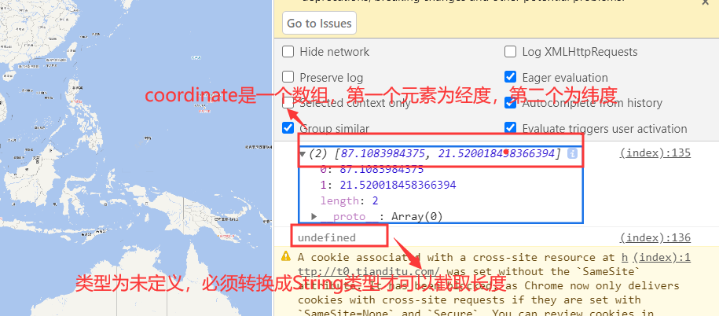
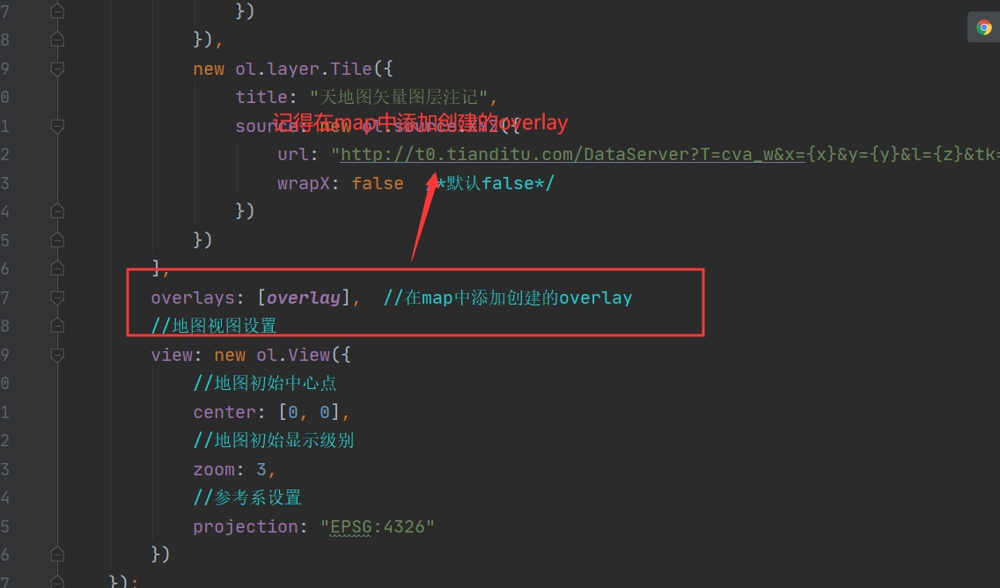
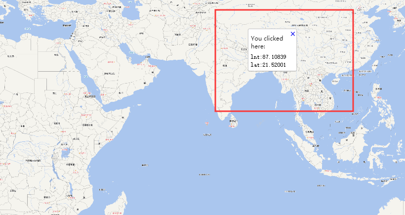

# Popup

点击地图得到一个弹出窗口。弹出窗口由几个基本**元素**组成：**容器**、**关闭按钮**和**内容位置**。要将弹出窗口定位到映射，将使用弹出容器创建ol/Overlay。为映射的click**事件**注册一个监听器来**显示弹出窗口**，另一个监听器被设置为close按钮的click处理程序来**隐藏弹出窗口**。

index.html代码：

```html
<!DOCTYPE html>
<html lang="en">
<head>
    <title>Popup</title>
    <style>
        .map {
            width: 100%;
            height:100%;
        }
        .ol-popup {
            position: absolute;
            background-color: white;
            box-shadow: 0 1px 4px rgba(0,0,0,0.2);
            padding: 15px;
            border-radius: 10px;
            border: 1px solid #cccccc;
            bottom: 12px;
            left: -50px;
            min-width: 280px;
        }
        .ol-popup:after, .ol-popup:before {
            top: 100%;
            border: solid transparent;
            content: " ";
            height: 0;
            width: 0;
            position: absolute;
            pointer-events: none;
        }
        .ol-popup:after {
            border-top-color: white;
            border-width: 10px;
            left: 48px;
            margin-left: -10px;
        }
        .ol-popup:before {
            border-top-color: #cccccc;
            border-width: 11px;
            left: 48px;
            margin-left: -11px;
        }
        .ol-popup-closer {
            text-decoration: none;
            position: absolute;
            top: 2px;
            right: 8px;
        }
        .ol-popup-closer:after {
            content: "✖";
        }
    </style>
    <link href="css/ol.css" type="text/css">
    <script src="js/jquery-1.11.2.min.js" type="text/javascript"></script>
    <script src="js/ol.js" type="text/javascript"></script>

</head>
<body>
<!--创建两个容器，一个用于放置map,一个用于放置Popup-->
<div id="map" class="map"><!--map容器-->
    <div id="popup" class="ol-popup"><!--Popup的目标容器-->
        <a href="#" id="popup-closer" class="ol-popup-closer"></a><!--Popup关闭按钮-->
        <div id="popup-content"></div><!--Popup的内容容器-->
    </div>
</div>

<script type="text/javascript">
    /**
     * Elements that make up the popup.
     */
    var container = document.getElementById('popup');
    var content = document.getElementById('popup-content');
    var closer = document.getElementById('popup-closer');

    /**
     * Create an overlay to anchor the popup to the map.
     */
    //平移地图时，autoPan如果为true（已弃用），则autoPanAnimation和autoPanMargin将用于确定平移参数
    var overlay = new ol.Overlay({
        element: container,
        /*autoPan: true,
        autoPanAnimation: {
            duration: 250,
        },*/
    });
    /**
     * Add a click handler to hide the popup.
     * @return {boolean} Don't follow the href.
     */
    closer.onclick = function () {
        overlay.setPosition(undefined);
        closer.blur();
        return false;
    };

    //实例化map对象加载地图
    var map = new ol.Map({
        //地图容器div的id
        target: 'map',
        //地图容器中加载的图层
        layers: [
            //加载瓦片图层数据
            new ol.layer.Tile({
                title: "天地图矢量图层",
                source: new ol.source.XYZ({
                    url: "http://t0.tianditu.com/DataServer?T=vec_w&x={x}&y={y}&l={z}&tk=b74ca9a5dbd96fab6338ab9d239180fb",
                    wrapX: false
                })
            }),
            new ol.layer.Tile({
                title: "天地图矢量图层注记",
                source: new ol.source.XYZ({
                    url: "http://t0.tianditu.com/DataServer?T=cva_w&x={x}&y={y}&l={z}&tk=b74ca9a5dbd96fab6338ab9d239180fb",
                    wrapX: false  /*默认false*/
                })
            })
        ],
        overlays: [overlay],  //在map中添加创建的overlay
        //地图视图设置
        view: new ol.View({
            //地图初始中心点
            center: [0, 0],
            //地图初始显示级别
            zoom: 3,
            //参考系设置
            projection: "EPSG:4326"
        })
    });

    /**
     * Add a click handler to the map to render the popup.
     */
    map.on('singleclick', function (evt) {
        //coordinate是一个经纬度坐标的数组，0为经度，1为纬度
        var coordinate = evt.coordinate;
        //console.log(coordinate);
        //console.log(coordinate.type);
        var lnt = coordinate[0].toString().substr(0,8);

        var lat = coordinate[1].toString().substr(0,8);
        //lat.substr(0,6);
        content.innerHTML = '<p>You clicked here:</p><code>' + 'lnt:'+lnt+'<br>'+'lat:'+lat + '</code>';
        overlay.setPosition(coordinate);   //设置overlay显示的位置，点击哪个位置，显示在哪个位置上
    });

</script>
</body>
</html>
```

★

coordinate的说明：



记得在map中添加创建的overlay:



效果：



