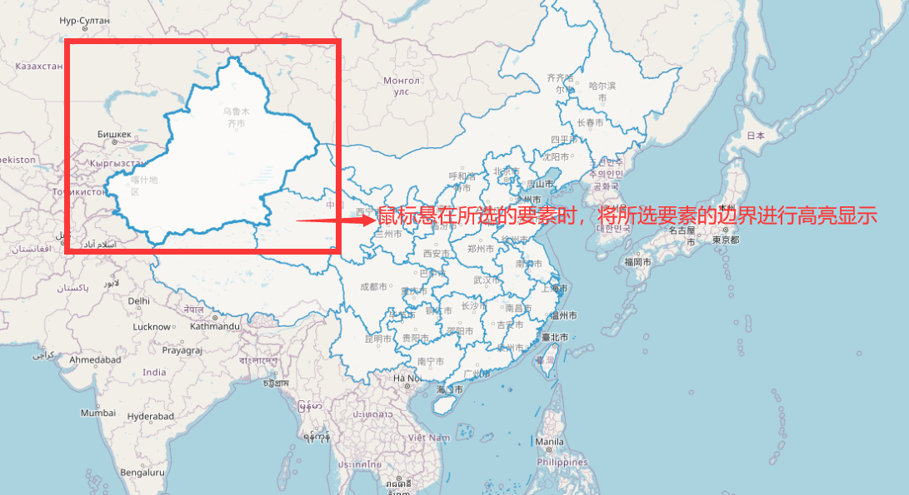
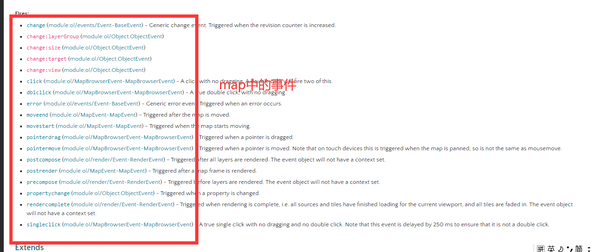

加载底图为OSM底图(瓦片底图)

```javascript
//底图，切片图层  Tile
    var raster = new ol.layer.Tile({
        source: new ol.source.OSM(),
    });
```

加载中国的geojson数据：

数据下载网站：<http://datav.aliyun.com/tools/atlas/#&lat=37.89219554724437&lng=87.07763671875&zoom=5>

下载后放在springboot初始化的项目下的static目录下：

使用geojson数据

```javascript
//加载的geojson数据，为矢量图层
    var vector = new ol.layer.Vector({
        source: new ol.source.Vector({
            url: 'china.json',
            format: new ol.format.GeoJSON(),
        }),
    });
```

显示地图：

```javascript
var map = new ol.Map({
        layers: [raster, vector],
        target: 'map',
        view: new ol.View({
            center: [0, 0],
            zoom: 2,
        }),
    });
```

核心代码：通过鼠标悬浮，判断是否选择到了要素，如果选择到了要素，则对其设置style即可

```javascript
	var selected = null;
    var status = document.getElementById('status');

    map.on('pointermove', function (e) {
        if (selected !== null) {
            selected.setStyle(undefined);
            selected = null;
        }

        map.forEachFeatureAtPixel(e.pixel, function (f) {
            selected = f;
            f.setStyle(highlightStyle);
            return true;
        });

        if (selected) {
            status.innerHTML = '&nbsp;Hovering: ' + selected.get('name');
        } else {
            status.innerHTML = '&nbsp;';
        }
    });
```

最终效果：



★map中的事件解析：



**地图点击事件：**

click:地图点击事件

dblclick:地图双击事件

**鼠标事件**

pointerdrag：鼠标拖拽事件。
pointermove：鼠标移动事件。

**地图渲染事件**

postcompose：地图渲染中。
precompose:准备渲染，未渲染。
postrender:渲染全部结束。

**地图移动事件**

moveend:地图移动结束发生

**复杂的change事件：**

change:layerGroup :地图图层增删时触发。
change:size :地图窗口发生变化就会触发，与我们常用的窗口resize接近。
change:target :地图绑定的div发生更改时触发，如map.setTartget方法就会触发该事件。
change:view :地图view对象发生变化触发。
propertychange: Map对象中任意的property值改变时触发。

(1)**在本项目中使用的是 map.on('pointermove', function (e) { 鼠标移动事件**

(2) map.forEachFeatureAtPixel(e.pixel, function (f) {

function(f)为图层回调函数。此回调将接收两个参数：第一个是layer，第二个参数是一个表示[R，G，B，A]像素值（0-255）的数组，对于当前不支持此参数的层类型，它将为null。为了停止检测，回调函数可以返回一个真实值。则**本次f为选择到的图层**，直接setStyle()即可