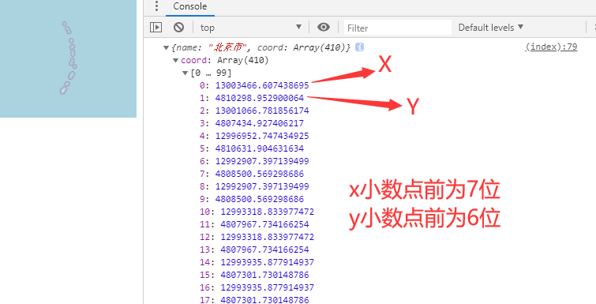
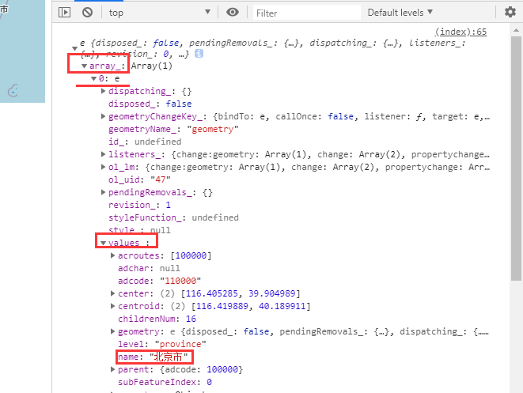
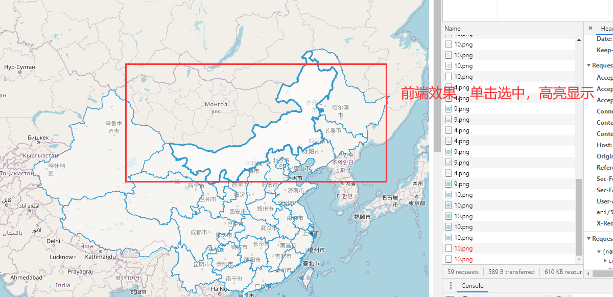
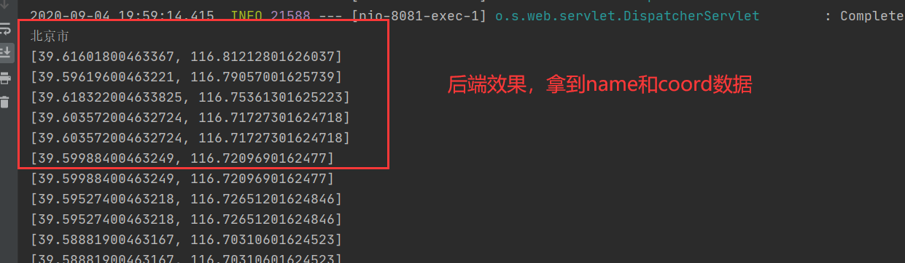

## SelectFeatureToJava

## 目的：

​	前端为osm底图+中国的geojson数据，通过点击(click或singleclick)中国的省份，可以选中geojson数据，将其封装成省份名称和坐标的组合形式，传到java后端

## 1.前端代码分析

### (1)页面布局分析

```html
<div id="map" class="map"></div>
<button id="SelectFeatureToJava" onclick="SelectFeatureToJava()">选择要素并传送给java后端</button>
```

id为map的div为加载map的容器，用来关联map中的target元素

button用来触发函数SelectFeatureToJava()，用来将选中的要素传到后端

### (2)osm瓦片底图加载

```javascript
//瓦片底图，源为OSM底图
    var raster = new ol.layer.Tile({
        source: new ol.source.OSM(),
    });
```

### (3)中国GeoJson数据加载，加载为矢量图层

```javascript
//中国的矢量图层，通过geojson数据和GeoJSON()解析器的方式加载进来
    var vector = new ol.layer.Vector({
        source: new ol.source.Vector({
            url: 'china.json',       
            format: new ol.format.GeoJSON(),
        }),
    });
```

china.json直接放在springboot项目下static目录下即可

### (4)将图层加载到map中并进行显示

```javascript
 //初始化map，加到id = "map"的容器中进行显示
    var map = new ol.Map({
        layers: [raster,vector],
        target:'map',
        view:new ol.View({
            center:[0,0],
            zoom:2,
            projection:'EPSG:3857',
        }),
    });
```

ol.view中默认的坐标系projection为EPSG:3857，即web墨卡托投影，坐标形式如下：



### (5)使用交互控件中的选择控件

```javascript
//使用交互控件中的选择控件ol.interaction.Select
    var select = new ol.interaction.Select({
        //condition:ol.event.condition.pointerMove, 鼠标指针移动时选择要素
        condition: ol.events.condition.SINGLECLICK,  //单击时选择要素
        style:new ol.style.Style({
            fill: new ol.style.Fill({
                color: 'rgba(255,255,255,0.7)',
            }),
            stroke: new ol.style.Stroke({
                color: '#3399CC',
                width: 3,
            }),
        })
    });
    map.addInteraction(select);
```

**ol.interaction.Select()**:

**简介**：select是交互事件中的一种，用于**选择矢量图层上的几何图形**

，添加选择交互事件后，点击地图上的几何图形或者将鼠标移动到几何图形上时，我们可以获取几何图形的相关信息，也可以将选择的几何图形进行高亮显示。

**使用方法**：创建一个Select对象，然后通过Map的addInteraction方法添加该对象即可

**属性**：

​	**addCondition**：指定一个函数，用于处理每一次事件。

​	**condition**：用于设置事件函数，返回`false`时不处理事件。

​	**layers**：用于过滤选择的图层，可以用数组指定图层，如果是函数，当返回false`时不处理事件。

​	**style**：设置选择时高亮显示的样式。

​	**removeCondition**：删除条件选择的函数。返回一个布尔值是否触发事件。

​	**toggleCondition**：切换条件选择的函数。返回一个布尔值是否触发事件。

​	**multi**：是否需要选择叠加的要素。默认为`false`。

​	**features**：设置要素选择的范围，如果设置了，只在该要素集下生效。

​	**filter**：选择过滤器。当返回false`时不处理事件。

​	**hitTolerance**：鼠标与几何图形之间的距离，距离越大越容易选中。	

**方法：**

​	**getFeatures**：获取选中的要素集。

​	**getHitTolerance**：获取鼠标与几何图形之间的距离。

​	**getLayer**：获取选中的图层。

​	**setHitTolerance**：设置鼠标与几何图形之间的距离。

在本项目中将condition属性设置为ol.events.condition.SINGLECLICK，即单击时选中要素，通过style设置了选中要素的高亮显示方式，后面还会通过getFeatures()方法获取选择的要素

### (6)按钮的触发函数SelectFeatureToJava()，获取选中的要素并将其传给后端

```javascript
	var selected = null;
    function SelectFeatureToJava() {
        //通过select控件的getFeatures()方法获取选中的要素
        selected = select.getFeatures();
        //console.log(selected);

        //省的坐标
        var coord = selected.array_[0].values_.geometry.flatCoordinates;
        //省的名称
        var name = selected.array_[0].values_.name;
        //console.log(coord);
        //console.log(name);
        
        //省份的名字和坐标组成的js对象
        var nameAndCoord = {
            name:name,
            coord:coord,
        };
        console.log(nameAndCoord);
        //通过ajax向后端发起请求
        $.ajax({
            //请求方式
            type: "post",
            url: "/featureToJava",
            data: JSON.stringify(nameAndCoord),
            contentType: "application/json;charsets=UTF-8",//必须
            dataType: "json",//必须
            success: function (data) { //回调函数，本次没用到
                console.log(data);
            }
        });
    }
```

要掌握：

​	通过select控件的getFeatures()方法获取选中的要素

​	学会在浏览器端调试输出数据，然后找到自己需要的数据



​	创建js对象，直接通过var的方式，然后输入属性和值

```javascript
var nameAndCoord = {
            name:name,
            coord:coord,
        };
```

​	在前端(js语法)使用到json数据时常用的两个方法:

​		JSON.stringify()：用来将js对象转换成JSON字符串

```javascript
var a = {a:1,b:2}
JSON.stringify(a)

//结果：
"{"a":1,"b":2}"
```

​		JSON.parse()：用来将JSON字符串转换成js对象

```javascript
var str = '{"name":"huangxiaojian","age":"23"}'
JSON.parse(str)
//结果：
Object
age: "23"
name: "huangxiaojian"
__proto__: Object
```

​	ajax请求，url与后端controller的对应，即请求方式的选择

## 2.后端代码分析

```java
@Controller
public class SelectFeaturesToJavaController {

    @PostMapping("/featureToJava")
    @ResponseBody
    public String featureToJava(@RequestBody String data) throws JSONException, JSONException {
        //System.out.println(data);
        //将字符串转换成json对象
        JSONObject jsonObject = new JSONObject(data);

        //拿到json对象中key为name的数据，，为string类型
        String name = jsonObject.getString("name");
        System.out.println(name);

        //拿到json对象中key为coord的数据，，为数组类型
        JSONArray coord = jsonObject.getJSONArray("coord");
        for (int i = 0;i<coord.length();i++){
            Double x = (Double) coord.get(i);  //数组下标为偶数，对应x  小数点前七位数
            Double y = (Double)coord.get(++i);  //数组下标为奇数，对于y  小数点前为6位
            //将web墨卡托投影转换位经纬度
            List lonLat = mercator2LonLat(x, y);
            System.out.println(lonLat);
        }

        //System.out.println(lon);
        //System.out.println(coord.toString());
        //System.out.println(coord);
        return "hello";
    }

    /**
     * web墨卡托 转 WGS-84，主要用于将坐标单位为米的值转为单位为度的值
     * @param {double} mercatorX X坐标
     * @param {double} mercatorY Y坐标
     * @author zjh 2018-08-23
     */
    public List<Double> mercator2LonLat(Double mercatorX, Double mercatorY) {
        Double lon =  mercatorX * 180 / 20037508.34;
        Double lat = (180 / Math.PI * (2 * Math.atan(Math.exp((mercatorY / 20037508.34) * Math.PI)) - Math.PI / 2));
        List<Double> list = new ArrayList();
        list.add(lat);
        list.add(lon);
        return list;
    }
```


**@RequestBody**主要用来接收前端传递给后端的json字符串中的数据的(请求体中的数据的)；GET方式无请求体，所以使用@RequestBody接收数据时，前端不能使用GET方式提交数据，而是用POST方式进行提交。在后端的同一个接收方法里，@RequestBody与@RequestParam()可以同时使用，@RequestBody最多只能有一个，而@RequestParam()可以有多个。

注：一个请求，只有一个RequestBody；一个请求，可以有多个RequestParam。

​	RequestBody 接收的是请求体里面的数据；而RequestParam接收的是key-value里面的参数		

## 3.效果

前端效果：



后端效果：




