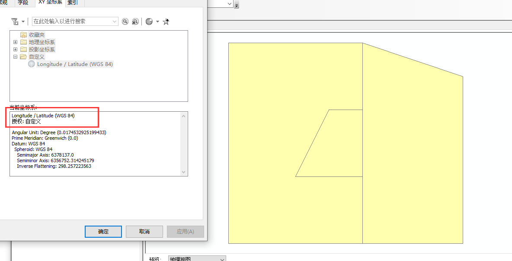
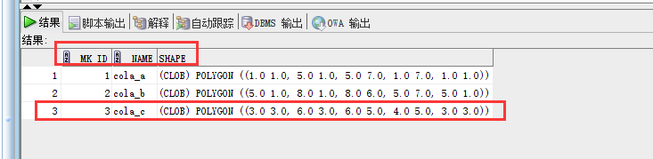
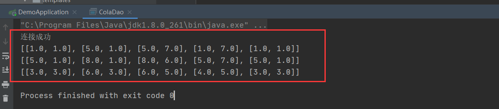
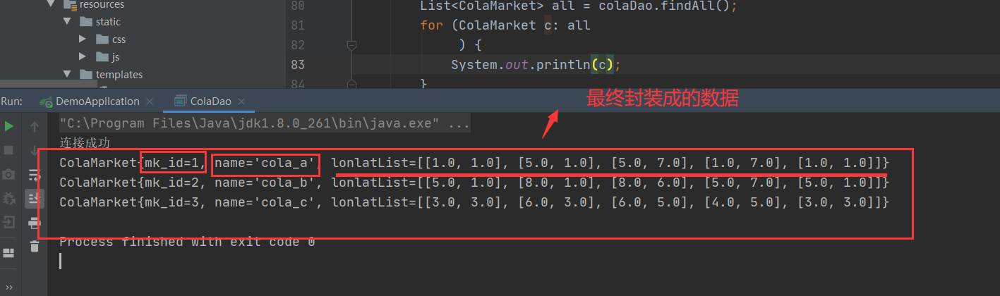
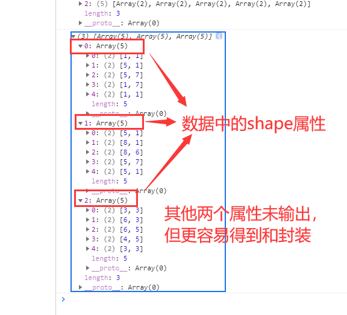
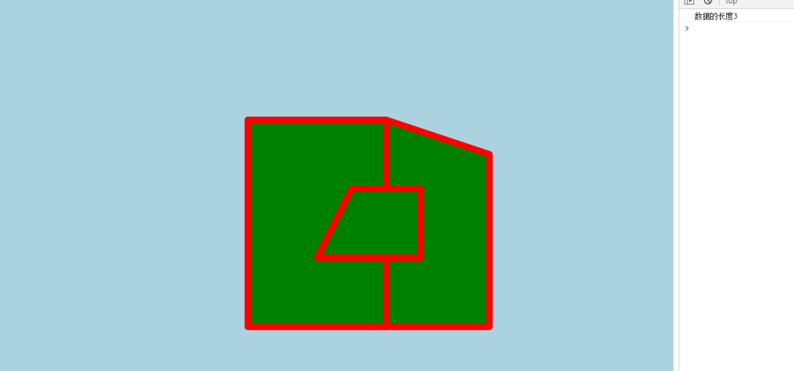

# OraclePloygonToWeb

## 目的：

​		(1)向oracle数据库中存入面ploygon

​	    	(2)查询出所需的(数据)面ploygon

​	    	(3)在前端进行显示

## 1.数据入库

sql的操作，将ploygon放入oracle数据库，数据比较少，我们直接使用oracle spatial的sql语句进行操作，当数据量比较大的时候，可以使用arccatlog将数据导入连接好的oracle数据库

(1)创建测试用表

```sql
create table cola_markets_cs(
  mk_id NUMBER PRIMARY KEY,  ---属性字段
  NAME VARCHAR2(32),         ---属性字段
  SHAPE SDO_GEOMETRY         ---oracle spatial中定义的空间数据的sdo_geometry
  );
```

(2)插入数据，3个矩形

```sql
INSERT INTO cola_markets_cs
VALUES(
  1,
  'cola_a',
  SDO_GEOMETRY(
    2003,   --二维Polygon,但不包含空岛
    8307,   --SRID,表示为WGS84坐标系，
    NULL,   --如果插入点，就写点的坐标，否则为空
    SDO_ELEM_INFO_ARRAY(1,1003,1),   --表示polygon
    SDO_ORDINATE_ARRAY(1,1,5,1,5,7,1,7,1,1)    --坐标数组
  )
);
```

```sql
----插入一个多边形
INSERT INTO cola_markets_cs
VALUES(
  2,
  'cola_b',
  SDO_GEOMETRY(
  2003,  --二维  Polygon
  8307,
  NULL,
  SDO_ELEM_INFO_ARRAY(1,1003,1),
  SDO_ORDINATE_ARRAY(5,1,8,1,8,6,5,7,5,1)
  )
);
```

```sql
----插入一个多边形
INSERT INTO cola_markets_cs
VALUES(
  3,
  'cola_c',
  SDO_GEOMETRY(
  2003,   --二维  polygon
  8307,
  NULL,
  SDO_ELEM_INFO_ARRAY(1,1003,1),
  SDO_ORDINATE_ARRAY(3,3,6,3,6,5,4,5,3,3)
  )
);
```

(3)插入元数据及索引的建立

```sql
--插入元数据
--一张表一般只用做一次，主要是告诉元数据视图，本张业务表空间字段的名称，以及空间范围（最大最小值），容忍度。
INSERT INTO user_sdo_geom_metadata(table_name,column_name,diminfo,srid)
VALUES(
  'cola_markets_cs',
  'shape',
  SDO_DIM_ARRAY(
  SDO_DIM_ELEMENT('Longitude',-180,180,10),   ---10m容差
  SDO_DIM_ELEMENT('Latitude',-90,90,10)      ---10m容差
  ),
  8307   --WGS84
);
```

```sql
--创建空间索引，提高查询效率
CREATE INDEX cola_spatial_idx_cs   --索引名
ON cola_markets_cs(shape)   --在该表的该字段上建立索引
INDEXTYPE IS MDSYS.SPATIAL_INDEX;
```

现在数据已经导入到数据库中了，我们可以使用arccatlog或arcmap连接oracle数据库，进行数据预览



## 2.查询出所需的数据

(1)为了方便起见，直接使用原生的ojdbc api即可

工具类，返回一个数据库连接

```java
public class ConnOracle {

    static String driverClass = "oracle.jdbc.driver.OracleDriver"; //oracle的驱动
    static String url = "jdbc:oracle:thin:@localhost:1521:ORCL"; //连接oracle路径方式 “”ORCL“”是要建立连接的数据库名 1521端口
    static String user = "scuser";//user是数据库的用户名
    static String password = "scuser";//用户登录密码

    //static方法直接点就可以引用了
    public static Connection getconn() {
        Connection conn = null;
        try {
            //首先建立驱动
            Class.forName(driverClass);
            //驱动成功后进行连接
            conn = DriverManager.getConnection(url, user, password);
            System.out.println("连接成功");
        } catch (SQLException e) {
            e.printStackTrace();
        } catch (Exception e) {
            e.printStackTrace();
        }
        return conn; //返回一个连接
    }
   
}
```

使用oracel spatial进行空间查询时，关于空间字段sdo_geometry，需要用到sdo_geometry.get_wkt()函数，传入所需字段名称即可查询，，得到的是以文本形式描述的sdo_geometry类型

```sql
select MK_ID,NAME,sdo_geometry.get_wkt(shape) shape from COLA_MARKETS_CS
```



另一个函数为sdo_geometry.getwkb()，得到的是以二进制形式描述的sdo_geometry类型

**我们选用以文本形式描述的sdo_geometry类型，使用字符串类型接受，然后通过字符串处理函数，变成我们需要的由经纬度组成的数组，再组成的数组**

处理结果为：



然后将数据封装到实体类中

```java
@Component
public class ColaMarket {

    private int mk_id;
    private String name;
    private List<List<Double>> lonlatList;   //通过shape处理的结果，可以来定义实体类中的字段
  //省略get,set方法，有参无参构造器，tostring()方法
```

将查询结果封装到实体类中：

```java
@Component
public class ColaDao {


    public List<ColaMarket> findAll(){
        Connection conn=null;
        Statement st=null;
        ResultSet rs=null;
        //用来存放需要返回的ColaMarkets数组
        List<ColaMarket> colaMarkets = new ArrayList<>();

        try {
            //1、获取连接对象
            conn= ConnOracle.getconn();
            //2、创建statement类对象，用来执行SQL语句！！
            st=conn.createStatement();
            //3、创建sql查询语句
            String sql="select MK_ID,NAME,sdo_geometry.get_wkt(shape) shape from COLA_MARKETS_CS";
            //4、执行sql语句并且换回一个查询的结果集
            rs=st.executeQuery(sql);
            while(rs.next()) {  //循环遍历结果集

                int mk_id=rs.getInt("MK_ID");
                String name = rs.getString("NAME");
                String shape = rs.getString("SHAPE");
                shape = shape.substring(10,53);
                String[] split1 = shape.split(",");  //先用逗号分隔字符串
                List<List<Double>> lonlatList = new ArrayList<List<Double>>();
                for (String split2:split1
                     ) {
                    String[] splitEnd = split2.split(" ");  //再用空格分隔字符串

                    //用来存放坐标的数组
                    List<Double> lonlat = new ArrayList<Double>();
                    for (String s: splitEnd
                         ) {

                        if (!s.equals("")) {
                            lonlat.add(Double.parseDouble(s));
                            //System.out.println(lonlat.toString());
                        }
                    }
                    lonlatList.add(lonlat);

                }
                //System.out.println(lonlatList.toString());

                //System.out.println("----------------");
                ColaMarket colaMarket = new ColaMarket();
                colaMarket.setMk_id(mk_id);
                colaMarket.setName(name);
                colaMarket.setLonlatList(lonlatList);
                colaMarkets.add(colaMarket);

            }
        } catch (Exception e) {
            e.printStackTrace();
        }
        return colaMarkets;
    }
```

数据最终封装成：



## 3.控制器将后端查询的数据传到前端

控制器的写法(通过@responsebody注解返回前端json即可)：

```java
@Controller
@ResponseBody
public class ColaController {

    @Resource
    private ColaDao colaDao;
    @GetMapping("/queryColaMarket")
    public List<ColaMarket> queryColaMarket(){
        return  colaDao.findAll();
    }
}
```

## 4.前端代码分析

页面布局：

```html
<div id="map" class="map"></div>
<button id="QueryColaMarket" onclick="QueryColaMarket()">获取后端market数据</button>
<button id="loadMap" onclick="loadMap()">加载底图</button>
```

id="map"的div为承载map的容器，之后会绑定ol.map的target元素

两个按钮，QueryColaMarket()是通过异步的请求，得到后端的数据

loadMap()函数是加载得到的数据并进行显示

**QueryColaMarket()函数：**

```javascript
    var shape;
    var shapes = new Array();
    function QueryColaMarket() {
        $.ajax({
            //请求方式
            type: "get",
            url: "/queryColaMarket",
            //data: JSON.stringify(nameAndCoord),
            contentType: "application/json;charsets=UTF-8",//必须
            dataType: "json",//必须
            success: function (data) { //回调函数，本次没用到
                //console.log(data);
                console.log("数据的长度"+data.length);  //3个几何
                for(var i = 0;i<data.length;i++){
                    var mk_id = data[i].mk_id;
                    var name = data[i].name;
                    shape = data[i].lonlatList;
                    //console.log(mk_id);
                    //console.log(name);
                    //console.log(shape);
                    shapes.push(shape);
                  
                }
            }
        });
    };
```

得到的数据为



**loadMap()函数：**

就是openlayers api的使用：

```javascript
function loadMap() {
        //填充的颜色
        var fill = new ol.style.Fill({
            color: 'green'
        });

        //边界的颜色
        var stroke = new ol.style.Stroke({
            color: 'red',
            width: 10
        });

        //将填充颜色和边界颜色组成style
        var style = new ol.style.Style({
            fill: fill,
            stroke: stroke
        });

        var polygon0 = new ol.geom.Polygon([shapes[0]]);
        var polygon1 = new ol.geom.Polygon([shapes[1]]);
        var polygon2 = new ol.geom.Polygon([shapes[2]]);


        //多边形要素类
        var feature0 = new ol.Feature(polygon0);
        var feature1 = new ol.Feature(polygon1);
        var feature2 = new ol.Feature(polygon2);

        //console.log(feature);
        

        //矢量图层
        var source =new ol.source.Vector();
        //将多边形要素类添加到矢量图层中
        source.addFeature(feature0);
        source.addFeature(feature1);
        source.addFeature(feature2);
        var vector = new ol.layer.Vector({
            source: source,
            style: style
        });

        //瓦片底图，源为OSM底图
        var raster = new ol.layer.Tile({
            source: new ol.source.OSM(),
        });
        //初始化map，加到id = "map"的容器中进行显示
        var map = new ol.Map({
            layers: [raster],
            target:'map',
            view:new ol.View({
                center:[0,0],
                zoom:3,
                //projection:'EPSG:3857',
            }),
        });
        //动态添加矢量图层
        map.addLayer(vector);
    }
```

重要api

**创建polygon:**

```javascript
var polygon = new ol.geom.Polygon([[[110, 39], [116, 39], [116, 33], [110, 33], [110, 39]]]);
```

**利用ploygon创建要素：**

```javascript
var feature = new ol.Feature(polygon);
```

最终效果：



★在ol中创建ploygon时，传入的参数不是数组，而是数组的数组

★本人并未做投影转换，数据库中的数据时WGS84坐标系(经纬度)，前端显示的数据坐标系为web墨卡托

★如果对复杂的sdo_geometry对象进行sdo_geometry.get_wkt(shape)操作，然后从返回的字符串中解析我们需要的空间数据，，，那，，，，，真是太蠢了。如果需要将sdo_geometry对象查询出来，做一些更新然后再插入数据库中，那解析字符串的方式就更蠢了。**需要用到oracle spatial Java api中的JGeometry类**

在oracleSpatialJavaApi项目中详细解释


