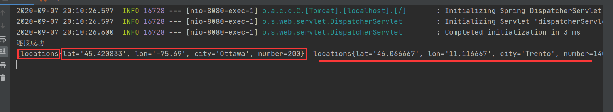
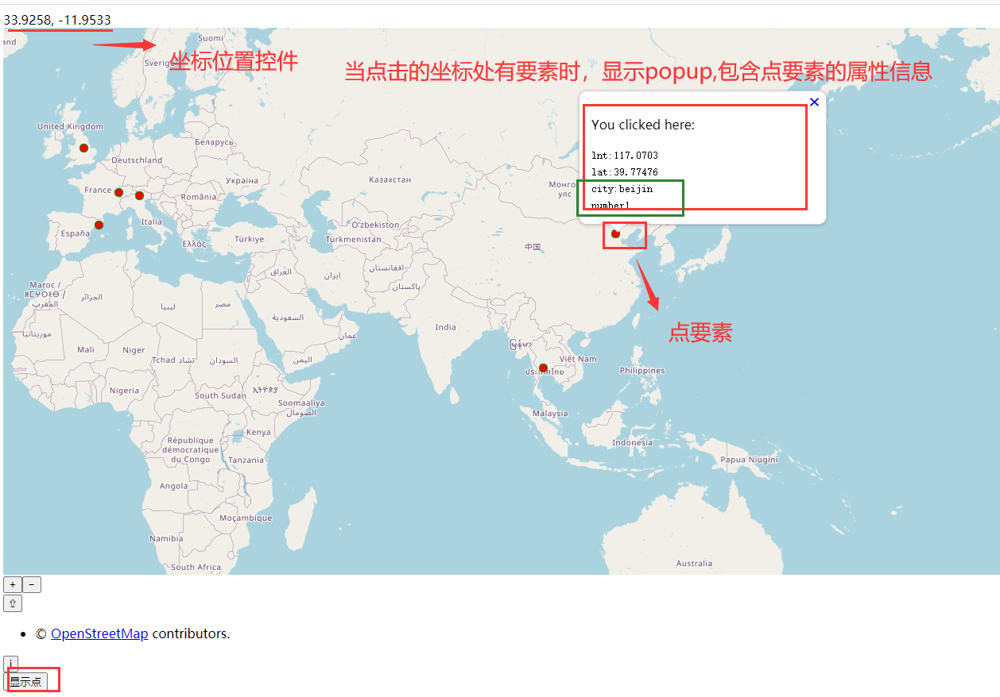
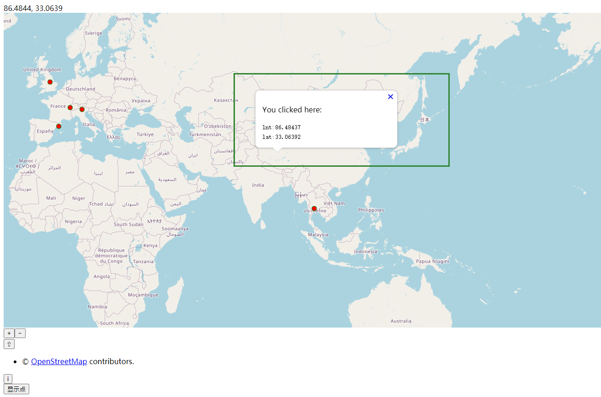

# oraclePointToWeb

## 1.目的：

​	从数据库中读取点信息，其中包含点的经纬度信息和属性信息(普通表，不涉及空间存储)

​	将点显示在前端，并加个popup，用来显示点的坐标信息和属性信息

​	在不是点要素的位置也弹出popup，只显示坐标信息即可

## 2.数据准备和简单后端查询

```sql
---创建表
CREATE TABLE "LOCATIONS" 
   ("LAT" VARCHAR2(522),    ---纬度
	"LON" VARCHAR2(522),    ---经度
	"CITY" VARCHAR2(522),   ---city名
	"NUMBER" NUMBER         ----number数据
   ) ;
```

```sql
---插入数据
Insert into LOCATIONS (LAT,LON,CITY,NUMBER) values ('45.420833','-75.69','Ottawa',200);
Insert into LOCATIONS (LAT,LON,CITY,NUMBER) values ('46.066667','11.116667','Trento',140);
Insert into LOCATIONS (LAT,LON,CITY,NUMBER) values ('44.9441','-93.0852','St Paul',125);
Insert into LOCATIONS (LAT,LON,CITY,NUMBER) values ('13.752222','100.493889100.493889','Bangkok',150);
Insert into LOCATIONS (LAT,LON,CITY,NUMBER) values ('44.9801','-93.251867','Minneapolis',350);
Insert into LOCATIONS (LAT,LON,CITY,NUMBER) values ('46.519833','6.6335','Lausanne',560);
Insert into LOCATIONS (LAT,LON,CITY,NUMBER) values ('48.428611','-123.365556','Victoria',721);
Insert into LOCATIONS (LAT,LON,CITY,NUMBER) values ('-33.925278','18.423889','Cape Town',550);
Insert into LOCATIONS (LAT,LON,CITY,NUMBER) values ('-33.859972','151.211111','Sydney',436);
Insert into LOCATIONS (LAT,LON,CITY,NUMBER) values ('41.383333','2.183333','Barcelona',914);
Insert into LOCATIONS (LAT,LON,CITY,NUMBER) values ('39.739167','-104.984722','Denver',869);
Insert into LOCATIONS (LAT,LON,CITY,NUMBER) values ('52.95','-1.133333','Nottingham',800);
Insert into LOCATIONS (LAT,LON,CITY,NUMBER) values ('45.52','-122.681944','Portland',840);
Insert into LOCATIONS (LAT,LON,CITY,NUMBER) values ('39.916527','116.397128','beijin',1);
```

后端的查询很简单(sql语句查询所有即可)

工具类：返回一个数据库连接

```java
public class ConnOracle {

    static String driverClass = "oracle.jdbc.driver.OracleDriver"; //oracle的驱动
    static String url = "jdbc:oracle:thin:@localhost:1521:ORCL"; //连接oracle路径方式 “”ORCL“”是要建立连接的数据库名 1521端口
    static String user = "scuser";//user是数据库的用户名
    static String password = "scuser";//用户登录密码

    //static方法直接点就可以引用了
    public static Connection getconn() {
        Connection conn = null;
        try {
            //首先建立驱动
            Class.forName(driverClass);
            //驱动成功后进行连接
            conn = DriverManager.getConnection(url, user, password);
            System.out.println("连接成功");
        } catch (SQLException e) {
            e.printStackTrace();
        } catch (Exception e) {
            e.printStackTrace();
        }
        return conn; //返回一个连接
    }
}
```

查询出的数据封装到实体类Locations.java

```java
@Component
public class Locations {

    private String lat; 
    private String lon;
    private String city;
    private int number;
  //省略有参无参构造器，get set方法  tostring()方法
```

dao层的数据查询和封装：返回一个包含很多locations类的列表

```java
@Repository
public class LocationsDao {

    Connection conn=null;
    Statement st=null;
    ResultSet rs=null;


    List<Locations> locationsList = new ArrayList<Locations>();
    public List<Locations> findAllLocations(){
        try {
            //1、获取连接对象
            conn= ConnOracle.getconn();
            //2、创建statement类对象，用来执行SQL语句！！
            st=conn.createStatement();
            //3、创建sql查询语句
            String sql="select * from locations";
            //4、执行sql语句并且换回一个查询的结果集
            rs=st.executeQuery(sql);
            while (rs.next()){
                //依次获取所需属性
                String lat = rs.getString("lat");
                String lon = rs.getString("lon");
                String city = rs.getString("city");
                int number = rs.getInt("number");
                //将获得的属性封装到实体类中
                Locations locations = new Locations();
                locations.setLat(lat);
                locations.setLon(lon);
                locations.setCity(city);
                locations.setNumber(number);
                locationsList.add(locations);

            }
        } catch (Exception e) {
            e.printStackTrace();
        }
        System.out.println(locationsList.toString());
        return locationsList;
    }

```

数据格式：



controller写法很简单，将dao查询出的数据以json格式返回给前端即可

```java
@Controller
public class LocationsController {

    @Resource
    private LocationsDao locationsDao;

    @ResponseBody
    @RequestMapping("/queryLocations")
    public List<Locations> findAllLocations(){
        return locationsDao.findAllLocations();
    }

}
```

## 2.前端代码逻辑分析

(1)页面布局

```html
<div id="map" class="map">
    <div id="popup" class="ol-popup"><!--Popup的目标容器-->
        <a href="#" id="popup-closer" class="ol-popup-closer"></a><!--Popup关闭按钮-->
        <div id="popup-content"></div><!--Popup的内容容器-->
    </div>
    <div id="mouse-position"><!--鼠标位置控件的容器，即所处的位置--></div>
</div>
<button id="PointDisplay" onclick="PointDisplay()">显示点</button>
```

id = "map"，是map容器，用来之后关联ol.map中的target元素

和popup有关的div用来设置popup弹出窗（包括目标容器，关闭按钮，内容容器3个）

id="mouse-position"用来放置鼠标位置控件，显示鼠标位置的经纬度

id="PointDisplay"的按钮，点击触发PointDisplay()函数，在地图上显示数据库中查询出的点

(2)实例化鼠标位置控件

```javascript
//实例化鼠标位置控件（MousePosition）
    var mousePositionControl = new ol.control.MousePosition({
        //坐标格式,将坐标保留4位小数位，并转换位字符串形式
        coordinateFormat: ol.coordinate.createStringXY(4),
        //地图投影坐标系（若未设置则输出为默认投影坐标系下的坐标）
        projection: 'EPSG:4326',  //WGS84,经纬度
        //坐标信息显示样式类名，默认是'ol-mouse-position'
        className: 'custom-mouse-position',
        //显示鼠标位置信息的目标容器
        target: document.getElementById('mouse-position'),
        //未定义坐标的标记   显示空格
        undefinedHTML: '&nbsp;'
    });
```

之后通过controls引入ol.map中即可

(2)点击按钮，显示点

```javascript
function PointDisplay() {
        $.ajax({
            //请求方式
            type: "get",
            url: "/queryLocations",
            //data: JSON.stringify(nameAndCoord),
            contentType: "application/json;charsets=UTF-8",//必须
            dataType: "json",//必须
            success: function (data) { //回调函数
                //console.log(data);
                console.log("数据的长度"+data.length);  //3个几何
                for(var i = 0;i<data.length;i++){//取出后端返回的数据
                    var lat = parseFloat(data[i].lat);
                    var lon = parseFloat(data[i].lon);
                    var city = data[i].city;
                    var number = data[i].number;
                    /*console.log(lat);
                    console.log(lon);
                    console.log(city);
                    console.log(number);*/

                    //创建点
                    //var point = new ol.geom.Point(ol.proj.fromLonLat([lon,lat]),'EPSG:4326');
                    var point = new ol.geom.Point(ol.proj.fromLonLat([lon,lat]));

                    //用点创建要素
                    var feature = new ol.Feature({
                        geometry: point,  //空间信息
                        city: city,       //属性信息
                        number: number    //属性信息
                    });

                    //将点要素放入要素数组中
                    featuresArray.push(feature);

                }
                console.log(featuresArray);

                //矢量图层
                var source =new ol.source.Vector({
                    features: featuresArray   //放入要素组
                });

                var vector = new ol.layer.Vector({
                    source: source,
                    style: new ol.style.Style({
                        image: new ol.style.Circle({
                            radius: 5,
                            fill: new ol.style.Fill({
                                color: 'red'
                            }),
                            stroke: new ol.style.Stroke({
                                color: 'green',
                                size: 1
                            })
                        })
                    })
                });

                //动态添加矢量图层
                map.addLayer(vector);
            }
        });
    };
```

重要api:

​	ol.proj.fromLonLat()，投影坐标转换，有两个参数，

​		第一个是数组类型的经纬度，[lon,lat]

​		第二个是目标投影坐标系，默认为'EPSG:3857'      (web墨卡托投影)

​		返回的是目标投影坐标系的坐标

​	创建点的api:ol.geom.Point()

​	创建要素的api:ol.Feature()，除了geometry空间数据，也可以向里面添加属性数据

(3)popup的设计和地图显示

```javascript
//popup的元素
    var container = document.getElementById('popup');
    var content = document.getElementById('popup-content');
    var closer = document.getElementById('popup-closer');

    //覆盖层
    var overlay = new ol.Overlay({
        element: container,
    });

    //popup关闭的操作函数
    closer.onclick = function () {
        overlay.setPosition(undefined);
        closer.blur();
        return false;
    };


    //瓦片底图，源为OSM底图
    var raster = new ol.layer.Tile({
        source: new ol.source.OSM(),
    });
    //初始化map，加到id = "map"的容器中进行显示
    var map = new ol.Map({
        layers: [raster],
        target:'map',
        overlays:[overlay],
        view:new ol.View({
            center:[0,0],
            zoom:3,
            projection:'EPSG:3857',
        }),
        controls: ol.control.defaults({//地图中默认控件
            /* @type {ol.control.Attribution} */
            attributionOptions: ({
                //地图数据源信息控件是否可收缩,默认为true
                collapsible: true
            })
        }).extend([mousePositionControl])//加载鼠标位置控件
    });

    map.on('singleclick', function (evt) {
        //coordinate是一个经纬度坐标的数组，0为经度，1为纬度
        var coordinate = evt.coordinate;
        //console.log(coordinate);
        //console.log(coordinate.type);

        //var lnt = coordinate[0].toString().substr(0,8);
        var lnt = coordinate[0].toString();
        lnt = (lnt * 180 / 20037508.34).toString().substr(0,8);

        //var lat = coordinate[1].toString().substr(0,8);
        var lat = coordinate[1].toString();
        lat = 180 / Math.PI * (2 * Math.atan(Math.exp((lat / 20037508.34) * Math.PI)) - Math.PI / 2);
        lat = lat.toString().substr(0,8);
        var feature = map.forEachFeatureAtPixel(evt.pixel, function (feature, layer) {
            //在视口中遍历所有具有像素颜色的图层，如果图层存在，则返回
            return feature;
        });
        console.log(feature);
        if(feature === undefined && feature == null){   //没有要素点
            content.innerHTML = '<p>You clicked here:</p><code>' + 'lnt:'+lnt+'<br>'+'lat:'+lat + '</code>';
            overlay.setPosition(coordinate);   //设置overlay显示的位置，点击哪个位置，显示在哪个位置上
        }else {  //有要素点
            var city = feature.values_.city;
            var number = feature.values_.number;
            content.innerHTML = '<p>You clicked here:</p><code>' + 'lnt:'+lnt+'<br>'+'lat:'+lat + '<br>'+
                'city:'+city+'<br>'+'number'+number+
                '</code>';
            overlay.setPosition(coordinate);   //设置overlay显示的位置，点击哪个位置，显示在哪个位置上
        }

    });
```

重点：就是在map.on的触发函数中，设置地图响应方式和响应事件(本项目是弹出popup)

触发函数：   **map.on('singleclick', function (evt)** {  //说明弹出方式是singleclick单击，evt可以获得点击的坐标

var coordinate = evt.coordinate;

由于获得的坐标是web墨卡托的坐标(EPSG:3857)，需要转换成经纬度(WGS84，EPSG:4326)进行显示

转换算法：

```java
/**
* WGS-84 转 web墨卡托，主要用于将坐标单位为度的值转为单位为米的值
* @param {double} lon 经度
* @param {double} lat 纬度
* @author zjh 2018-08-23
*/
function lonLat2Mercator(lon, lat) {
    var x = lon * 20037508.34 / 180;
    var y = Math.log(Math.tan((90 + lat) * Math.PI / 360)) / Math.PI * 20037508.34;
    y = Math.max(-20037508.34, Math.min(y, 20037508.34));
    return { 'x': x, 'y': y };
}

/**
* web墨卡托 转 WGS-84，主要用于将坐标单位为米的值转为单位为度的值
* @param {double} mercatorX X坐标
* @param {double} mercatorY Y坐标
* @author zjh 2018-08-23
*/
function mercator2LonLat(mercatorX, mercatorY) {
    var lon = mercatorX * 180 / 20037508.34;
    var lat = 180 / Math.PI * (2 * Math.atan(Math.exp((mercatorY / 20037508.34) * Math.PI)) - Math.PI / 2);
    return { 'x': lon, 'y': lat };
}
```

获得点击点的要素：

```javascript
var feature = map.forEachFeatureAtPixel(evt.pixel, function (feature, layer) {
            //在视口中遍历所有具有像素颜色的图层，如果图层存在，则返回
            return feature;
        });
```

通过判断点击点是否有要素，设置弹出框的不同显示方式

结果：点击点要素



点击不是点要素：



